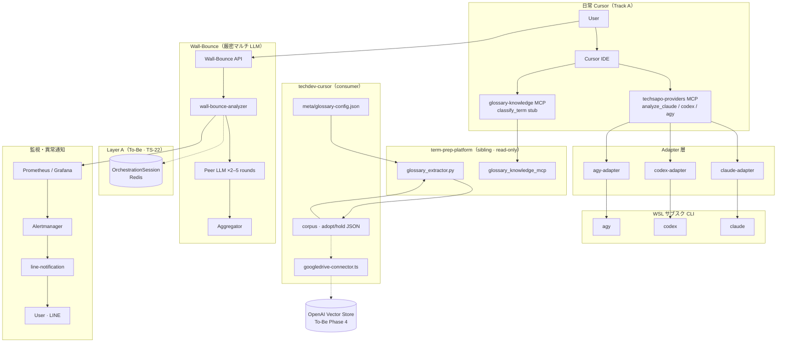

# techdev-cursor

統一 MCP（`analyze_claude` / `analyze_codex` / `analyze_agy`）による日常の Cursor コーディング向けマルチ LLM 基盤。

> **IT 障害解析 / InfraOps ラインではない** — 位置づけは [FORK_CURSOR.md](./docs/ja/FORK_CURSOR.md)。

*[English](README_en.md) | **日本語***

---

## What & why

| | |
|---|---|
| **What** | Cursor 向けの統一 MCP と、Claude / Codex / Antigravity（`agy`）各 CLI を束ねる開発基盤。複数 LLM の合意が必要な分析では Wall-Bounce を使う |
| **Why** | **手早く・正確に・サブスクの範囲で**ソフトウェアを作れるようにするため |
| **Not** | IT 障害の解析・運用向けプラットフォーム。モデルを選べるだけのマルチモデルツール |

---

## なぜ Wall-Bounce か

[Antigravity](https://antigravity.google/docs/models) などは **Claude / GPT / Gemini へのアクセス** を1つの harness にまとめる。**モデル選択** はできても、**1 プロンプトに対して複数 LLM がラウンドを重ねて協調・合意する** 機能はない。

| | マルチモデル harness（例: Antigravity） | Wall-Bounce |
|---|---|---|
| 複数モデルへのアクセス | ✅ | ✅（`agy` / `codex` / `claude`） |
| 同一プロンプトへの多 LLM 協調 | ❌ | ✅ **2–5 ラウンド** + 合意・品質ゲート |
| 出力 | 1 モデル → 1 回答 | 2+ provider → 構造的合意 |

**価値は「どの LLM を使うか」ではなく「複数 LLM をどう協調させるか」。** 日常 Cursor は単一 MCP；厳密分析は Wall-Bounce API。

---

## アーキテクチャ（概要）

| 経路 | 用途 |
|------|------|
| **Cursor → techsapo-providers → adapter → CLI** | 日常コーディング（単一 MCP 呼び出し） |
| **Cursor → glossary-knowledge → term-prep-platform** | 用語分類スタブ（Phase 0 · knowledge filter 無効） |
| **corpus + config → glossary_extractor → adopt/hold** | RAG 前処理（`npm run glossary:extract` · platform は read-only 実行） |
| **adopt/hold → googledrive-connector → Vector Store** | RAG ingest（**Phase 4 · 未配線**） |
| **Wall-Bounce API → analyzer** | 2+ LLM 協調・合意が必要な分析 |
| **Prometheus → line-notification** | 異常検知時の **LINE Webhook 通知**（実装済み） |

詳細: [ARCHITECTURE.md](./docs/ARCHITECTURE.md) · [TO-BE-GLOSSARY-PIPELINE.md](./meta/TO-BE-GLOSSARY-PIPELINE.md) · [MONITORING_OPERATIONS.md](./docs/MONITORING_OPERATIONS.md)

---

## 次に読むもの

| 目的 | ドキュメント |
|------|-------------|
| **現状・Gate 進捗** | [FORK_STATUS.md](./docs/ja/FORK_STATUS.md) |
| **実行・Track（要約）** | [CURSOR_MCP_TODO_ja.md](./docs/ja/CURSOR_MCP_TODO_ja.md) |
| **実行・Track（正本・英語）** | [CURSOR_MCP_TODO.md](./docs/CURSOR_MCP_TODO.md) |
| フォークの位置づけ | [FORK_CURSOR.md](./docs/ja/FORK_CURSOR.md) |
| 設計思想・成熟度 | [FORK_ONBOARDING.md](./docs/ja/FORK_ONBOARDING.md) |
| 用語抽出（RAG 前処理・consumer） | [meta/TO-BE-GLOSSARY-PIPELINE.md](./meta/TO-BE-GLOSSARY-PIPELINE.md) |
| AI エージェント | [AGENTS.md](./AGENTS.md)（英語） |
| ドキュメント一覧 | [DOCUMENTATION_INDEX.md](./docs/DOCUMENTATION_INDEX.md) |
| ドキュメント方針 | [DOCUMENTATION_POLICY.md](./docs/DOCUMENTATION_POLICY.md) |

---

## クイックスタート（開発者）

**前提:** Node.js ≥20（`package.json` `engines`）

1. [FORK_CURSOR.md](./docs/ja/FORK_CURSOR.md) — スコープと構成  
2. [CURSOR_MCP_TODO_ja.md](./docs/ja/CURSOR_MCP_TODO_ja.md) — 実行要約 · [§ A-0 詳細（英語）](./docs/CURSOR_MCP_TODO.md#a-0-wsl-native-install--authentication)  
3. `npm run cursor-mcp:config` — Cursor に統一 MCP を登録  
4. 用語抽出（RAG 前処理）— `npm run glossary:extract` · [meta/TO-BE-GLOSSARY-PIPELINE.md](./meta/TO-BE-GLOSSARY-PIPELINE.md)（consumer のみ編集 · platform は read-only）

---

## 憲法（要約）

Wall-Bounce: **最低 2 ラウンド・最大 5**；confidence ≥ 0.7；consensus ≥ 0.6；実装は `wall-bounce-analyzer.ts` のみ。

**To-Be UX:** Aggregator 出力後の会話継続・negative 再試行（upward temperature jitter）— [TS-24 ADR](./docs/decisions/TECH_STACK_SESSION_CONTINUATION_AND_RETRY.md)（実装は Track B）。

詳細: [AGENTS.md](./AGENTS.md) · [WALL_BOUNCE_SYSTEM.md](./docs/WALL_BOUNCE_SYSTEM.md)（英語）

---

## ライセンス・サポート

MIT — [package.json](./package.json) の `license` フィールドを参照。Issue: [GitHub](https://github.com/wombat2006/techdev-cursor/issues)。
