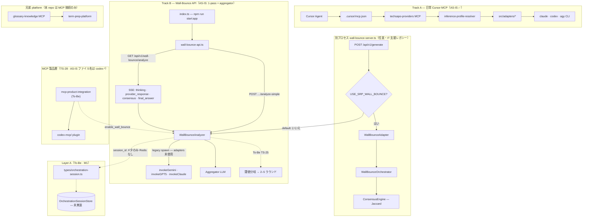

# techdev-cursor

統一 MCP（`analyze_claude` / `analyze_codex` / `analyze_agy`）による日常の Cursor コーディング向けマルチ LLM 基盤。

> **IT 障害解析 / InfraOps ラインではない** — 位置づけは [FORK_CURSOR.md](./docs/ja/FORK_CURSOR.md)。

*[English](README_en.md) | **日本語***

---

## ゴール（To-Be）

**このリポジトリが目指す姿** — 詳細は [WALL_BOUNCE_TO_BE.md](./docs/WALL_BOUNCE_TO_BE.md) · ADR [TS-25](./docs/decisions/TECH_STACK_WALL_BOUNCE_MODE_ROUTING.md)

| 領域 | To-Be |
|------|-------|
| **日常 Cursor（Track A）** | 統一 MCP で単一 LLM 呼び出し（必要ならエージェントが複数回 `analyze_*`） |
| **厳密マルチ LLM（Track B）** | **デフォルト:** 複数 LLM を**並列**実行 → **アグリゲータで合議** → 閾値（confidence / consensus）未達なら**自動で壁打ちモード**（憲法どおり **2–5 ラウンド**） |
| **モード切替** | プロンプト文言（例: 「壁打ちで」）や MCP 設定で、壁打ち即時 / 並列のみ / **シリアル連鎖**（シリアル時は合議閾値なし）を選択可能 |
| **可観測性** | 各 LLM の応答・合議過程・分岐判断を **SSE** で追跡可能（Layer A に永続化） |
| **異議** | 合議結果への異議 → 再問い合わせ → **ユーザーが次の振る舞いを選択** |
| **事前難易度計測** | **行わない**（実装コストのため。閾値分岐で代替） |

**価値:** 「どの LLM か」ではなく「複数 LLM をどう協調させるか」— [なぜ Wall-Bounce か](#なぜ-wall-bounce-か) 参照。

---

## 現在地（AS-IS）

> **コード上の実装は [AS-IS](./docs/WALL_BOUNCE_AS_IS.md) のとおりです。** To-Be との差分は文書化済みで、**改修・実装を Track B / C で進行中**です。README のゴール記述は To-Be を表し、動作保証は AS-IS ドキュメントと `src/` を参照してください。

| 領域 | いま動いているもの | To-Be との主な差分 |
|------|-------------------|-------------------|
| **Track A — MCP** | `analyze_claude` / `analyze_codex` / `analyze_agy`（単発・adapter 経由）— **G7 Pass** | モードキーワード連携は未 |
| **Track B — Wall-Bounce API** | `wall-bounce-analyzer.ts`：並列 or 逐次 **1 パス + アグリゲータ 1 回**で終了 | 閾値分岐・2–5 ラウンドループ・異議 UI なし |
| **閾値** | ログ警告程度；低スコアでも**再実行・分岐しない** | 未達時に壁打ちモードへ自動分岐 |
| **トランスポート** | MCP は adapters；analyzer は **legacy spawn** | B-1 で統一予定 |
| **Legacy MCP 製品層** | AS-IS: `codex-mcp-integration.ts`（**名称は歴史的**・偽 WB）· 本番 API 未接続 | **TS-28 P0** → `mcp-product-integration` + 憲法 WB 委譲 |
| **記憶（Layer A）** | 型・ADR のみ；Redis store **未** | M1–M3 |
| **SSE** | 部分実装（応答 500 文字切り詰め等） | B-5 で拡張予定 |

**進捗・Gate:** [FORK_STATUS.md](./docs/ja/FORK_STATUS.md) · **コード実態の正本:** [WALL_BOUNCE_AS_IS.md](./docs/WALL_BOUNCE_AS_IS.md)

---

## これから必要なこと

To-Be 到達に向けた作業（実行順の目安）— ファイル単位は [WALL_BOUNCE_IMPLEMENTATION_BACKLOG.md](./docs/WALL_BOUNCE_IMPLEMENTATION_BACKLOG.md) · チェックリストは [CURSOR_MCP_TODO.md](./docs/CURSOR_MCP_TODO.md)

| 優先 | 内容 | Track | Gate |
|------|------|-------|------|
| 1 | Layer A 永続化（`OrchestrationSessionStore` / Redis） | **M1** | B→C 前提 |
| 2 | Wall-Bounce → `src/adapters/*` 配線 | **B-1** | B→C |
| 2a | **MCP 製品層** — ベンダ中立名へ移行・憲法 WB 委譲（NAME-VN） | **TS-28 P0** | SRP #8 前 |
| 2b | CLI から **usage / stop_reason / session_id**（TS-26） | **B-6** | B→C |
| 3 | 並列→合議→**閾値分岐**・キーワードモード（TS-25） | **B-4** | B→C G7 |
| 4 | SSE + Layer A ストリーム | **B-5** | B→C |
| 5 | `inference-profiles.json` · TS-24 retry | **B-0** | B→C |
| 6 | 壁打ちモードでの **2–5 ラウンド enforce** | **C-4** | Gate C |
| 7 | **Hard gate**（本 repo） | **C-1** | Gate C |
| 7b | **PromptAnalyzer · 辞書 v0** — [term-prep-platform](https://github.com/wombat2006/term-prep-platform) **側で実装**；本 repo は **MCP で接続**（`glossary-knowledge`） | platform + MCP | Gate C（C-2/C-3） |
| 8 | 異議ワークフロー | **C-7** | Gate C G7 |
| 9 | Analyzer / Orchestrator 統合 | **C-5** | Gate C |

**PromptAnalyzer / 辞書 v0:** 形態素解析・辞書 lookup の本体は **term-prep-platform に実装**する。本 repo（consumer）では実装しない — 兄弟クローンを MCP **`glossary-knowledge`** で呼び出せば足りる（[`.cursor/mcp.json`](./.cursor/mcp.json) 登録済み · 詳細 [RAG_SETUP_GUIDE.md](./docs/RAG_SETUP_GUIDE.md) · [TO-BE-GLOSSARY-PIPELINE.md](./meta/TO-BE-GLOSSARY-PIPELINE.md)）。プラットフォーム変更が必要なときはユーザーへエスカレーション（[AGENTS.md](./AGENTS.md)）。

**いまのフォーカス:** Track **B**（Gate A→B は Pass）— [CURSOR_MCP_TODO_ja.md](./docs/ja/CURSOR_MCP_TODO_ja.md) 要約

---

## What & why

| | |
|---|---|
| **What** | Cursor 向けマルチ LLM コーディング基盤 — 日常は統一 MCP、厳密分析は Wall-Bounce API |
| **Why** | サブスク CLI の範囲で、複数 LLM 協調により精度と信頼性を上げる |
| **Not** | IT 障害プラットフォーム · モデル選択だけのツール |

---

## なぜ Wall-Bounce か

[Antigravity](https://antigravity.google/docs/models) 等は複数モデルへのアクセスを1つにまとめるが、**同一プロンプトへの協調・合意**は提供しない。

| | マルチモデル harness | 本リポジトリ（To-Be） |
|---|---|---|
| 複数モデルへのアクセス | ✅ | ✅ |
| 同一プロンプトへの協調 | ❌ | ✅ 並列→合議→必要なら壁打ち |
| 出力 | 1 モデル → 1 回答 | 2+ provider → 構造的合意 |

---

## アーキテクチャ（概要）

コード実態に基づく経路図（`src/` 監査 2026-06-22）。**破線 = To-Be / 未配線**。

| 経路 | AS-IS 今日（コード） | To-Be |
|------|---------------------|-------|
| Cursor → MCP → adapters → CLI | ✅ 単発 `analyze_*`（集約・ラウンドなし） | 同左 + モードキーワード連携 |
| `index.ts` → `server/` | ✅ `TechSapoServer`；モジュール分割済（SRP） | 変更なし |
| `wall-bounce-analyzer.ts` | ✅ シム → `services/wall-bounce/`（憲法パス維持） | B-1 adapters · 閾値分岐（B-4） |
| `codex-mcp-integration.ts` | AS-IS ファイル名のみ（**TS-28 NAME-VN** で `mcp-product-integration` へ） | 憲法 WB は analyzer 正規入口 |
| `wall-bounce-server.ts` | シム → `wall-bounce-server/`；デフォルトは analyzer | C-5 で統合 |
| MCP monitoring / config (SRP) | ✅ `mcp-config-manager/` · `mcp-performance-monitor/` · `ultra-conservative-monitor/` · `srp-safety-monitor/` | 変更なし |
| Layer A / SSE | 型のみ · SSE 部分（応答 500 文字切り詰め）· `session_id` 未永続 | M1–M3 · B-5 |
| term-prep-platform | `glossary-knowledge` を `.cursor/mcp.json` 登録 | PromptAnalyzer · 辞書 v0 は **platform 側** |

詳細: [ARCHITECTURE.md](./docs/ARCHITECTURE.md) · [WALL_BOUNCE_SYSTEM.md](./docs/WALL_BOUNCE_SYSTEM.md)

---

## Wall-Bounce ドキュメント（必読）

| ドキュメント | 役割 |
|-------------|------|
| **[WALL_BOUNCE_TO_BE.md](./docs/WALL_BOUNCE_TO_BE.md)** | 目指す姿・ギャップマトリクス |
| **[WALL_BOUNCE_AS_IS.md](./docs/WALL_BOUNCE_AS_IS.md)** | **コードから確定した現状** |
| [WALL_BOUNCE_IMPLEMENTATION_BACKLOG.md](./docs/WALL_BOUNCE_IMPLEMENTATION_BACKLOG.md) | 改修ポイント一覧 |
| [TECH_STACK_WALL_BOUNCE_MODE_ROUTING.md](./docs/decisions/TECH_STACK_WALL_BOUNCE_MODE_ROUTING.md) | TS-25 ADR |
| [TECH_STACK_CODEX_MCP_INTEGRATION_REFACTOR.md](./docs/decisions/TECH_STACK_CODEX_MCP_INTEGRATION_REFACTOR.md) | **TS-28 v1.2** — MCP 製品層改修；**ルーティング前にベンダ名禁止**（NAME-VN） |

---

## 次に読むもの

| 目的 | ドキュメント |
|------|-------------|
| **Gate・進捗** | [FORK_STATUS.md](./docs/ja/FORK_STATUS.md) |
| **コード構造（SRP 分割）** | [SRP_MONOLITH_REFACTOR.md](./docs/SRP_MONOLITH_REFACTOR.md) · [依存順序](./docs/SRP_REFACTOR_DEPENDENCY_ORDER.md) |
| **実行 Runbook** | [CURSOR_MCP_TODO_ja.md](./docs/ja/CURSOR_MCP_TODO_ja.md) · [正本（英語）](./docs/CURSOR_MCP_TODO.md) |
| フォーク identity | [FORK_CURSOR.md](./docs/ja/FORK_CURSOR.md) |
| 設計思想 | [FORK_ONBOARDING.md](./docs/ja/FORK_ONBOARDING.md) |
| AI エージェント | [AGENTS.md](./AGENTS.md) |
| 全文索引 | [DOCUMENTATION_INDEX.md](./docs/DOCUMENTATION_INDEX.md) |
| **検討中（未採用・優先外）** | [NestJS strangler（TS-29 Idea）](./docs/ideas/NESTJS_STRANGLER_MIGRATION_IDEA.md) — HTTP 層のみ；効果・低コスト実装可否を評価；**採用未定** |

---

## 命名（TS-28 NAME-VN）

**憲法 Wall-Bounce は全プロバイダ共通。** ルーティング（`enable_wall_bounce` 等）**より前**のモジュール・公開 API に `codex` / `claude` / `agy` 等の固有名を付けない。Codex 固有は **`codex-mcp/` プラグイン以降**のみ。詳細: [TS-28 §4.11](./docs/decisions/TECH_STACK_CODEX_MCP_INTEGRATION_REFACTOR.md#411-vendor-neutral-naming-name-vn).

---

## クイックスタート（開発者）

**前提:** Node.js ≥20

1. [FORK_CURSOR.md](./docs/ja/FORK_CURSOR.md)  
2. [CURSOR_MCP_TODO § A-0](./docs/CURSOR_MCP_TODO.md#a-0-wsl-native-install--authentication)  
3. `npm run setup-mcp-prereqs` · `npm install`  
4. `cp .env.brv.local.example .env.brv.local` → `npm run setup-brv-provider`  
5. `npm run build` — pull 後は `src/` 変更時のみ  
6. `.cursor/mcp.json` 同梱（routine pull 後の MCP Reload 不要 — [ルール](./.cursor/rules/cursor-mcp-post-pull.mdc)）

---

## 憲法（目標値）

Wall-Bounce の**目標契約:** 壁打ちモードで **2–5 ラウンド** · confidence ≥ 0.7 · consensus ≥ 0.6 · 実装経路 `wall-bounce-analyzer.ts`。

> 憲法は To-Be の契約。**現行コードがすべてを満たすわけではない** — [AS-IS](./docs/WALL_BOUNCE_AS_IS.md) §14 · Track C で enforce 予定。

詳細: [AGENTS.md](./AGENTS.md) · [WALL_BOUNCE_SYSTEM.md](./docs/WALL_BOUNCE_SYSTEM.md)

---

## ライセンス・サポート

MIT — [package.json](./package.json)。Issue: [GitHub](https://github.com/wombat2006/techdev-cursor/issues)。
