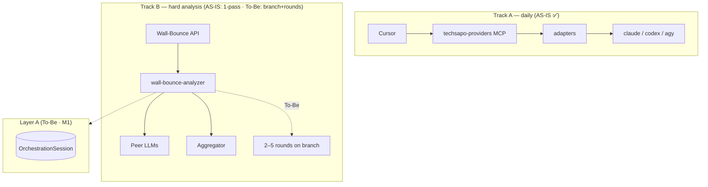

# techdev-cursor

Multi-LLM platform for daily Cursor coding via unified MCP (`analyze_claude` / `analyze_codex` / `analyze_agy`).

> **Not** IT incident / InfraOps analysis — see [FORK_CURSOR.md](./docs/FORK_CURSOR.md).

*[English](README_en.md) | [日本語（GitHub top）](README.md)*

---

## Goal (To-Be)

**What this repo is building toward** — full spec: [WALL_BOUNCE_TO_BE.md](./docs/WALL_BOUNCE_TO_BE.md) · ADR [TS-25](./docs/decisions/TECH_STACK_WALL_BOUNCE_MODE_ROUTING.md)

| Area | To-Be |
|------|-------|
| **Daily Cursor (Track A)** | Unified MCP single-LLM invokes (`analyze_*`) |
| **Hard multi-LLM (Track B)** | **Default:** parallel peers → **aggregator consensus** → if below thresholds, **auto wall-bounce mode** (constitution **2–5 rounds**) |
| **Mode overrides** | Prompt keywords (e.g. force wall-bounce) and MCP config; **serial chain** mode with **no consensus gate** |
| **Observability** | Follow peer outputs, deliberation, and branch decisions via **SSE** (persisted to Layer A) |
| **Objections** | Challenge aggregator reasoning → re-query → **user picks next behavior** |
| **Upfront difficulty scoring** | **None** — replaced by post-aggregate threshold branch |

**Value:** not “which LLM” but “how LLMs cooperate” — see [Why Wall-Bounce](#why-wall-bounce).

---

## Where we are (AS-IS)

> **Running code matches [AS-IS](./docs/WALL_BOUNCE_AS_IS.md).** Gaps vs To-Be are documented; **repair and implementation are in progress** on Track B / C. README goal text describes To-Be; for behavior guarantees use the AS-IS doc and `src/`.

| Area | Works today | Main gap vs To-Be |
|------|-------------|-------------------|
| **Track A — MCP** | `analyze_*` single-shot via adapters — **G7 Pass** | No mode-keyword routing yet |
| **Track B — Wall-Bounce API** | `wall-bounce-analyzer.ts`: **one** parallel or sequential pass + one aggregation | No threshold branch, no 2–5 round loop, no objection UX |
| **Thresholds** | Warn in logs; **no retry/branch** on low scores | Auto wall-bounce on miss |
| **Transport** | MCP uses adapters; analyzer uses **legacy spawn** | Unify in B-1 |
| **Memory (Layer A)** | Types + ADR only; **no Redis store** | M1–M3 |
| **SSE** | Partial (e.g. 500-char truncate) | Extend in B-5 |

**Progress & Gates:** [FORK_STATUS.md](./docs/FORK_STATUS.md) · **Code truth:** [WALL_BOUNCE_AS_IS.md](./docs/WALL_BOUNCE_AS_IS.md)

---

## What we need to get there

Work packages toward To-Be (suggested order) — per-file tasks: [WALL_BOUNCE_IMPLEMENTATION_BACKLOG.md](./docs/WALL_BOUNCE_IMPLEMENTATION_BACKLOG.md) · checklist: [CURSOR_MCP_TODO.md](./docs/CURSOR_MCP_TODO.md)

| Priority | Work | Track | Gate |
|----------|------|-------|------|
| 1 | Layer A persistence (`OrchestrationSessionStore` / Redis) | **M1** | B→C prerequisite |
| 2 | Wire Wall-Bounce to `src/adapters/*` | **B-1** | B→C |
| 3 | Parallel → aggregate → **threshold branch**; keyword modes (TS-25) | **B-4** | B→C G7 |
| 4 | SSE + Layer A event stream | **B-5** | B→C |
| 5 | `inference-profiles.json` · TS-24 retry | **B-0** | B→C |
| 6 | **2–5 round enforce** in wall-bounce mode | **C-4** | Gate C |
| 7 | **Hard gate** (this repo) | **C-1** | Gate C |
| 7b | **PromptAnalyzer · dictionary v0** — implemented on **[term-prep-platform](https://github.com/wombat2006/term-prep-platform)**; this repo **connects via MCP** (`glossary-knowledge`) | platform + MCP | Gate C (C-2/C-3) |
| 8 | Objection workflow | **C-7** | Gate C G7 |
| 9 | Analyzer / Orchestrator merge | **C-5** | Gate C |

**PromptAnalyzer / dictionary v0:** Morphological parsing and dictionary lookup are **implemented on term-prep-platform**, not in this consumer repo. Wire them in by calling the sibling clone over MCP **`glossary-knowledge`** ([`.cursor/mcp.json`](./.cursor/mcp.json) already registered · [RAG_SETUP_GUIDE.md](./docs/RAG_SETUP_GUIDE.md) · [TO-BE-GLOSSARY-PIPELINE.md](./meta/TO-BE-GLOSSARY-PIPELINE.md)). Escalate to the user when platform changes are required ([AGENTS.md](./AGENTS.md)).

**Current focus:** Track **B** (Gate A→B Pass) — [CURSOR_MCP_TODO.md](./docs/CURSOR_MCP_TODO.md)

---

## What & why

| | |
|---|---|
| **What** | Multi-LLM coding platform for Cursor — daily MCP, hard analysis via Wall-Bounce API |
| **Why** | Better accuracy through multi-LLM coordination within subscription CLI cost |
| **Not** | IT incident platform · model picker only |

---

## Why Wall-Bounce

Tools like [Antigravity](https://antigravity.google/docs/models) bundle model access but do **not** coordinate multiple LLMs on one prompt with consensus.

| | Multi-model harness | This repo (To-Be) |
|---|---|---|
| Multi-family access | ✅ | ✅ |
| Coordination on one prompt | ❌ | ✅ parallel → consensus → wall-bounce if needed |
| Output | One model → one answer | 2+ providers → structured agreement |

---

## Architecture (overview)

| Path | AS-IS today | To-Be |
|------|-------------|-------|
| Cursor → MCP → CLIs | ✅ single `analyze_*` | Same + mode keywords |
| Wall-Bounce API | 1-pass + aggregate | Threshold branch · round enforce |
| Layer A / SSE | Partial / unwired | Full round log · live stream |
| term-prep-platform → MCP | `glossary-knowledge` registered (stub) | PromptAnalyzer · dictionary v0 on **platform**; use via MCP |

Details: [ARCHITECTURE.md](./docs/ARCHITECTURE.md) · [WALL_BOUNCE_SYSTEM.md](./docs/WALL_BOUNCE_SYSTEM.md)

---

## Wall-Bounce documentation (required reading)

| Document | Role |
|----------|------|
| **[WALL_BOUNCE_TO_BE.md](./docs/WALL_BOUNCE_TO_BE.md)** | Target behavior · gap matrix |
| **[WALL_BOUNCE_AS_IS.md](./docs/WALL_BOUNCE_AS_IS.md)** | **Code-derived current state** |
| [WALL_BOUNCE_IMPLEMENTATION_BACKLOG.md](./docs/WALL_BOUNCE_IMPLEMENTATION_BACKLOG.md) | Modification checklist |
| [TECH_STACK_WALL_BOUNCE_MODE_ROUTING.md](./docs/decisions/TECH_STACK_WALL_BOUNCE_MODE_ROUTING.md) | TS-25 ADR |

---

## Where to go next

| Need | Document |
|------|----------|
| **Gates & progress** | [FORK_STATUS.md](./docs/FORK_STATUS.md) · [日本語](./docs/ja/FORK_STATUS.md) |
| **Execution runbook** | [CURSOR_MCP_TODO.md](./docs/CURSOR_MCP_TODO.md) · [ja summary](./docs/ja/CURSOR_MCP_TODO_ja.md) |
| Fork identity | [FORK_CURSOR.md](./docs/FORK_CURSOR.md) |
| Design depth | [FORK_ONBOARDING.md](./docs/FORK_ONBOARDING.md) |
| AI agents | [AGENTS.md](./AGENTS.md) |
| Full index | [DOCUMENTATION_INDEX.md](./docs/DOCUMENTATION_INDEX.md) |

---

## Quick start (developers)

**Prerequisite:** Node.js ≥20

1. [FORK_CURSOR.md](./docs/FORK_CURSOR.md)  
2. [CURSOR_MCP_TODO § A-0](./docs/CURSOR_MCP_TODO.md#a-0-wsl-native-install--authentication)  
3. `npm run setup-mcp-prereqs` · `npm install`  
4. `cp .env.brv.local.example .env.brv.local` → `npm run setup-brv-provider`  
5. `npm run build` — after pull only when `src/` changed  
6. `.cursor/mcp.json` tracked (**no routine MCP Reload after pull** — [rule](./.cursor/rules/cursor-mcp-post-pull.mdc))

---

## Constitution (target contract)

Wall-Bounce **target:** **2–5 rounds** in wall-bounce mode · confidence ≥ 0.7 · consensus ≥ 0.6 · via `wall-bounce-analyzer.ts`.

> Constitution describes To-Be contract. **Current code does not fully enforce it** — [AS-IS](./docs/WALL_BOUNCE_AS_IS.md) §14 · Track C planned.

Details: [AGENTS.md](./AGENTS.md) · [WALL_BOUNCE_SYSTEM.md](./docs/WALL_BOUNCE_SYSTEM.md)

---

## License & support

MIT — [package.json](./package.json). Issues: [GitHub](https://github.com/wombat2006/techdev-cursor/issues).
