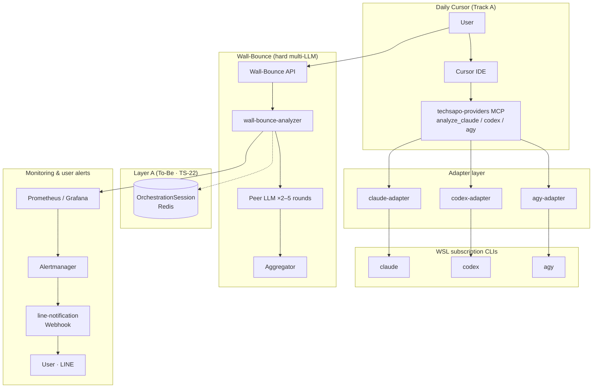

# TechSapo — DevAssist Fork (`techdev-cursor`)

> **PRIMARY REPO** — Cursor-integrated development environment for **coding accuracy** and **workload reduction**.  
> Fork of [wombat2006/techdev](https://github.com/wombat2006/techdev) (Wall-Bounce multi-LLM platform).  
> **Not** IT incident / InfraOps analysis (upstream fork line).

Multi-LLM orchestration for daily Cursor coding via unified MCP (`analyze_claude` / `analyze_codex` / `analyze_agy`).

*[English](README_en.md) | [日本語（GitHub トップ）](README.md)*

---

## What & why

| | |
|---|---|
| **What** | DevAssist fork — Wall-Bounce + unified provider MCP + subscription CLIs |
| **Why** | Build software **accurately, efficiently, at subscription-scale cost** |
| **Not** | IT incident platform · multi-model picker only (no orchestration) |

---

## Why Wall-Bounce (not just multi-model access)

Tools like [Antigravity](https://antigravity.google/docs/models) consolidate **access to Claude, GPT, and Gemini** in one harness. You can **pick a model**, but they do **not** run **multiple LLMs in coordinated rounds on the same prompt** with consensus and quality gates.

| | Multi-model harness (e.g. Antigravity) | TechSapo Wall-Bounce |
|---|---|---|
| Access to several model families | ✅ | ✅ (`agy` / `codex` / `claude`) |
| Multi-LLM coordination on one prompt | ❌ | ✅ **2–5 rounds** + consensus gates |
| Output | One model → one answer | 2+ providers → structured agreement |

**This repo’s value is not “which LLM” but “how LLMs cooperate.”** Daily Cursor: single MCP per call; hard analysis: Wall-Bounce API.

---

## Architecture (overview)

| Path | Role |
|------|------|
| **Cursor → unified MCP → adapters** | Daily coding (single MCP invoke) |
| **Wall-Bounce API → analyzer** | Multi-LLM coordination + consensus |
| **Prometheus → line-notification** | **LINE Webhook** alerts on anomalies (implemented) |

Details: [ARCHITECTURE.md](./docs/ARCHITECTURE.md) · [MONITORING_OPERATIONS.md](./docs/MONITORING_OPERATIONS.md)

---

## Where to go next

| Need | Document |
|------|----------|
| **Current status & Gates** | [FORK_STATUS.md](./docs/FORK_STATUS.md) · [日本語](./docs/ja/FORK_STATUS.md) |
| **Execute tasks / Tracks** | [CURSOR_MCP_TODO.md](./docs/CURSOR_MCP_TODO.md) · [要約（日本語）](./docs/ja/CURSOR_MCP_TODO_ja.md) |
| Fork identity & layout | [FORK_CURSOR.md](./docs/FORK_CURSOR.md) · [日本語](./docs/ja/FORK_CURSOR.md) |
| Design depth & maturity | [FORK_ONBOARDING.md](./docs/FORK_ONBOARDING.md) · [日本語](./docs/ja/FORK_ONBOARDING.md) |
| AI agents | [AGENTS.md](./AGENTS.md) |
| Full doc map | [DOCUMENTATION_INDEX.md](./docs/DOCUMENTATION_INDEX.md) |
| Documentation rules | [DOCUMENTATION_POLICY.md](./docs/DOCUMENTATION_POLICY.md) |

---

## Quick start (developers)

**Prerequisite:** Node.js ≥20 (`package.json` `engines`)

1. [FORK_CURSOR.md](./docs/FORK_CURSOR.md) — scope and directory layout  
2. [CURSOR_MCP_TODO.md § A-0](./docs/CURSOR_MCP_TODO.md#a-0-wsl-native-install--authentication) — WSL CLI auth (`claude` / `codex` / `agy`)  
3. `npm run cursor-mcp:config` — register unified MCP in Cursor  

---

## Constitution (summary)

Wall-Bounce: **at least 2 rounds, at most 5**; confidence ≥ 0.7; consensus ≥ 0.6; implementation via `wall-bounce-analyzer.ts` only.

**To-Be UX:** Post-Aggregator session continuation and negative-feedback retry (upward temperature jitter) — [TS-24 ADR](./docs/decisions/TECH_STACK_SESSION_CONTINUATION_AND_RETRY.md) (Track B implementation).

Details: [AGENTS.md](./AGENTS.md) · [WALL_BOUNCE_SYSTEM.md](./docs/WALL_BOUNCE_SYSTEM.md)

---

## License & support

MIT — see `license` in [package.json](./package.json). Issues: [GitHub](https://github.com/wombat2006/techdev-cursor/issues).
