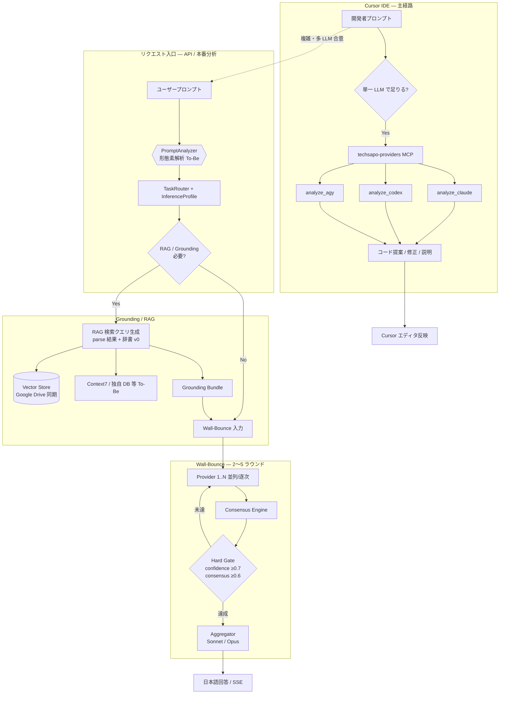

# TechSapo - AIオーケストレーション付きIT基盤支援ツール

> **PRIMARY REPO — `techdev-cursor`**  
> **このリポジトリの位置づけ:** 壁打ち（Wall-Bounce）システムを備えた upstream [`techdev`](https://github.com/wombat2006/techdev) をフォークして作成した、**Cursor IDE 向け統合開発環境構築プロジェクト**。**目的:** **コーディング精度の向上**と**コーディング負荷の軽減**（マルチ LLM 壁打ち・Unified MCP・サブスクリプション CLI 連携）。**IT 障害解析に特化した PRJ ではない**（それは upstream の InfraOps フォークライン）。  
> 詳細: [docs/FORK_CURSOR.md](./docs/FORK_CURSOR.md) · 手順: [docs/CURSOR_MCP_TODO.md](./docs/CURSOR_MCP_TODO.md)

**Wall-Bounce 多 LLM 協調**と **Cursor 統合開発環境** — コーディング精度向上・負荷軽減を目的とした DevAssist フォーク（[`techdev-cursor`](./docs/FORK_CURSOR.md)）

*[English](README.md) | 日本語*

## 🎯 コアアーキテクチャ

### 壁打ち分析システム（必須壁打ち）
すべてのクエリで複数LLMによる協調分析を実行する革新的システム
- **必須要件**: 最低2つのLLMによる分析実行
- **合意形成**: 複数の回答から最適解を導出
- **品質保証**: ハルシネーション検証とエスカレーション機能

### マルチLLMオーケストレーション

> OpenAI モデル ID: [OPENAI_MODEL_MATRIX.md](./docs/OPENAI_MODEL_MATRIX.md)。マルチベンダー特性: [config/llm-model-catalog.json](./config/llm-model-catalog.json)（[TS-21](./docs/decisions/TECH_STACK_LLM_MODEL_CATALOG.md)）、[OpenAI Cookbook](./docs/OPENAI_COOKBOOK_INTEGRATION.md) 由来の `apiFeatures` / `references[]` / `cookbookIndex` を含む。**呼び出し方針（Context7 照合済）:** カタログ = 経路チャネル + 能力 + `nativeModelFlag`；アダプタ（`src/adapters/*`）= 具体 CLI/API — [TS-21 §5](./docs/decisions/TECH_STACK_LLM_MODEL_CATALOG.md)。**AS-IS コード**は legacy 名のままの箇所あり。

- **Tier 0**: Context7 / Stash — リファレンス層（非 LLM）
- **Tier 1**: Claude Code CLI — 開発 routing · Unified MCP
- **Tier 2**: Antigravity CLI（`agy`）+ **GPT-5.4 mini / nano** — 高速・高ボリューム（To-Be；現行は Codex CLI）
- **Tier 3**: Claude Sonnet 4.5 + OpenRouter — 複雑分析
- **Tier 4**: **GPT-5.5** — Responses API 優先 · codex 系モデルのみ Codex CLI
- **Tier 5**: **GPT-5.5 Pro** + Claude Opus 4.1 — 集約 / 最難問 critique

### LLM モデルカタログ（TS-21）

3 層分離 — カタログ・リクエスト単位パラメータ・アダプタ argv を混同しない:

| 層 | ファイル | 役割 |
|----|----------|------|
| **LlmModelCatalog** | `config/llm-model-catalog.json` | **WHAT:** モデル特性・上限・経路・Cookbook 参照 |
| **InferenceProfile** | `inference-profiles.json`（[TS-20](./docs/decisions/TECH_STACK_INFERENCE_PROFILES.md)） | **HOW:** effort / temperature / cot |
| **Provider アダプタ** | `src/adapters/{claude,codex,agy}-adapter.ts` | **BIND:** 具体 CLI spawn / API body（コードで版管理） |

- JSON Schema: [config/schemas/llm-model-catalog.schema.json](./config/schemas/llm-model-catalog.schema.json)
- `transport.invocationBindingRef` は実装へのポインタのみ（`spawnArgs` はカタログに書かない）
- Cookbook 同期: Track F-7 · Codex MCP コマンド整合: Track F-8

## 🔄 処理フロー

本フォーク（`techdev-cursor`）における **コーディング支援** の End-to-End 経路。**AS-IS**（現行）と **To-Be**（P5 / Track C 計画）を併記。

### 全体像



### A. Cursor 開発支援フロー（主経路）

| Step | 処理 | 実装 |
|------|------|------|
| 1 | Cursor でタスク入力（実装・リファクタ・デバッグ） | Cursor IDE |
| 2 | 単一モデルで十分 → `techsapo-providers` MCP を stdio spawn | `techsapo-providers-mcp-server.ts` |
| 3 | MCP → CLI アダプタ → subscription 実行 | `src/adapters/*` |
| 4 | 結果をエディタ / チャットに反映 | — |

### B. Wall-Bounce 多 LLM 分析フロー

| Step | 処理 | AS-IS | To-Be |
|------|------|-------|-------|
| 1 | プロンプト受信 | API / SSE | + **PromptAnalyzer（形態素解析）** |
| 2 | タスク種別・複雑度 | regex ヒューリスティック | parse + 辞書 + TaskRouter |
| 3 | Provider 選定・分析 2+ LLM | ✅ | adapter 統一（Track B） |
| 4 | コンセンサス · Hard Gate | 部分 | 憲法 enforce（Track C） |
| 5 | Aggregator → 日本語出力 | ✅ | — |

### C. RAG / Grounding フロー

**取り込み:** Google Drive Webhook → DL → Vector Store（`googledrive-webhook-handler.ts`）。**AS-IS では Embedding 前に形態素解析しない。**

**クエリ時:**

| Step | AS-IS | To-Be |
|------|-------|-------|
| クエリ受信 | ✅ | — |
| 形態素解析 + 辞書 | ❌ | ✅ PromptAnalyzer（RAG 検索クエリ生成**前**） |
| RAG 検索 → Grounding Bundle | 部分 | Orchestrator 統合 |
| Wall-Bounce 根拠付き回答 | ✅ | — |

### D. 形態素解析（PromptAnalyzer）の位置づけ

RAG が必要な場合、**RAG 検索クエリ生成前**および**プロンプト認識精度向上**のため形態素解析前処理を行う（**Track C-2 計画中**）。

| 用途 | 内容 |
|------|------|
| クエリ正規化 · 専門語認識 | `devassist-dictionary-v0.json` 照合 |
| TaskRouter / RAG term 抽出 | 1 リクエスト 1 parse、結果を共有 |
| 非用途 | プロンプト本体の形態素置換 · Embedding 前の一律前処理 |

#### より確からしい投入フェーズ

| フェーズ | 評価 |
|----------|------|
| **① リクエスト入口 PromptAnalyzer**（RAG **検索クエリ**生成前） | ✅ **第一推奨** — routing と RAG term を 1 parse で処理 |
| **② Vector Store 投入（Embedding）前** | ⚠️ 一律適用 **非推奨** — hybrid 索引メタのみ Phase 2 で条件付き |
| **③ LLM プロンプト置換** | ❌ **非採用** |

> 「RAG 前処理」= **② ingest 前ではなく ① クエリ時 PromptAnalyzer** が主戦場。

詳細: [WALL_BOUNCE_P5 §7](./docs/decisions/WALL_BOUNCE_P5_ARCHITECTURE.md#7-形態素解析の位置づけ) · [CURSOR_MCP_TODO § C-2](./docs/CURSOR_MCP_TODO.md)

## 🚀 主要機能

> **フォークのスコープ:** 本リポジトリ（`techdev-cursor`）は **コーディング支援・開発生産性** が主眼。下記の IT 障害解析等は upstream プラットフォームの汎用機能であり、**このフォークの主目的ではない**（InfraOps 系フォーク向け）。

### 🤖 AI駆動分析
- **壁打ち分析**: 複数LLMによる協調分析で高品質な回答生成
- **IT障害解析**: システムログとエラー出力の自動分析
- **RAG検索**: GoogleDrive統合による個人データ活用
- **3段階品質**: Basic/Premium/Critical対応

### 📊 包括的監視機能
- **Prometheus統合**: 20+のカスタムメトリクス
- **Grafana可視化**: 経営/運用/開発ダッシュボード
- **3段階アラート**: P0（即座）/P1（15分）/P2（1時間）対応
- **コスト監視**: リアルタイム予算追跡（月額$70）

### 🔐 エンタープライズセキュリティ
- **セキュリティメトリクス**: 認証・レート制限・入力検証
- **GDPR/HIPAA準拠**: 機密情報マスキング
- **監査ログ**: MySQL全活動記録
- **SSL/TLS**: Let's Encrypt自動更新

### 🏗️ 本番環境インフラ
- **Docker完全対応**: フルコンテナ化
- **SSL証明書自動更新**: 90日サイクル
- **ゼロダウンタイム**: Nginx + PM2
- **高可用性**: Prometheus HA + Grafana クラスタリング

## 📋 必要環境

- Node.js 18.0.0 以上
- Docker & Docker Compose（または Podman）
- **Claude Code CLI**（`claude`）— Anthropic MAX / OAuth（WSL ネイティブ必須。`ANTHROPIC_API_KEY` は MCP/CLI 経路では使わない）
- **Codex CLI**（`codex`）— OpenAI subscription codegen（モデル ID は [OPENAI_MODEL_MATRIX.md](./docs/OPENAI_MODEL_MATRIX.md) へ移行予定）
- **Antigravity CLI**（`agy`）— Google Tier 1（Gemini 2.5 Pro/Flash）。WSL ネイティブ必須
- API キー: Hugging Face（埋め込み等）、OpenRouter 等（Google Gemini / Anthropic API キー直埋めは禁止）
- （オプション）本番環境用 Redis、MySQL

> 3 つの subscription CLI（`claude` / `codex` / `agy`）は WSL ネイティブでインストール・認証 — 詳細手順: [docs/CURSOR_MCP_TODO.md § A-0](./docs/CURSOR_MCP_TODO.md#a-0-wsl-native-install--authentication)  
> Google Tier 1 / Wall-Bounce: `agy --print` — [docs/ANTIGRAVITY_CLI_MIGRATION.md](docs/ANTIGRAVITY_CLI_MIGRATION.md)

### Claude Code CLI（Anthropic MAX / OAuth）

Cursor MCP の `analyze_claude` およびターミナルからの単発呼び出しに使用。**API キーではなく OAuth サブスクリプション**（MAX 等）を利用します。

```bash
# インストール（WSL — Windows npm の claude.exe ではない）
npm install -g @anthropic-ai/claude-code
which claude   # /mnt/c/.../npm/claude でないこと

# 認証（いずれか）
claude login
# または Windows 資格情報を WSL に symlink:
# ln -sf /mnt/c/Users/<YOU>/.claude/.credentials.json ~/.claude/.credentials.json

# API キーで課金されないよう無効化
unset ANTHROPIC_API_KEY

# 動作確認（MCP アダプタと同じ --print 経路）
claude --print --model sonnet --effort low "Reply with only: ok"
```

| 用途 | コマンド |
|------|----------|
| 対話セッション | `claude` |
| Cursor MCP / スクリプト | `claude --print --model sonnet "…"` |

### Codex CLI（OpenAI subscription）

`analyze_codex` の非対話経路: `codex exec --model <id> …`（[`codex-adapter.ts`](./src/adapters/codex-adapter.ts)）。PM2 の Codex MCP は CLI サブコマンド要確認（`codex mcp-server` vs 旧 `codex mcp serve`）— [Track F-8](./docs/PROVIDER_INTEGRATION_BACKLOG.md)。

```bash
npm install -g @openai/codex
which codex      # WSL ネイティブパスであること
codex login
test -f ~/.codex/auth.json && echo "codex auth ok"

# 動作確認（非対話 — MCP アダプタと同系）
codex exec "Reply with only: ok"
```

### Antigravity CLI（Google Tier 1）

```bash
# インストール（WSL）
curl -fsSL https://antigravity.google/cli/install.sh | bash
which agy   # ~/.local/bin/agy であること（Windows npm の gemini ではない）

# 認証（対話 UI — 初回またはトークン更新時）
agy auth login

# 動作確認（Wall-Bounce と同じ経路: stdin + --print）
echo "Reply with only: ok" | agy --print --model gemini-2.5-flash
echo "Reply with only: ok" | agy --print --model gemini-2.5-pro
```

| 用途 | コマンド |
|------|----------|
| 対話で試す | `agy auth login` |
| Wall-Bounce / スクリプト | `echo "…" \| agy --print --model gemini-2.5-flash` |

オプション: `ANTIGRAVITY_CLI_BIN` でバイナリパスを上書き可能。

### Unified Provider MCP（Cursor — Track A-1）

単一 stdio サーバー `techsapo-providers` が CLI アダプタ経由で各 LLM を直接呼び出します（subscription quota）。

| Tool | Provider | Transport |
|------|----------|-----------|
| `analyze_claude` | Claude Code | `claude --print`（OAuth） |
| `analyze_codex` | Codex | `codex exec`（非対話） |
| `analyze_agy` | Antigravity | `agy --print`（stdin） |

```bash
npm run build
npm run techsapo-providers-mcp   # 起動確認（Cursor 登録は template 参照）
```

詳細: [config/cursor-mcp.template.json](./config/cursor-mcp.template.json) · [docs/PROVIDER_INTEGRATION_BACKLOG.md](./docs/PROVIDER_INTEGRATION_BACKLOG.md)

## 🛠 クイックスタート

### 1. リポジトリセットアップ
```bash
git clone git@github.com:wombat2006/techdev-cursor.git
cd techdev-cursor
npm install
```

### 2. 環境設定
```bash
cp .env.example .env
# .envファイルにAPIキーを設定してください
```

### 3. ビルドと起動
```bash
# .env に HUGGINGFACE_API_KEY 等を設定（pm2-start が起動前に検証）
npm run build              # TypeScript ビルド + dist/config/*.json コピー
npm run pm2:start          # techsapo + codex-mcp（= npm start）
# npm run pm2:start:all    # + production-monitor
# npm run pm2:status       # プロセス一覧

# legacy nohup + PID ファイル
# npm run start:legacy
```

### 4. Cursor MCP 登録（オプション）
```bash
# A-0: WSL ネイティブ claude / codex / agy + 認証 — docs/CURSOR_MCP_TODO.md
npm run build
# config/cursor-mcp.template.json を Cursor Settings → MCP に反映
```

## 🎯 主要エンドポイント

### 壁打ち分析API
```bash
# 基本IT支援
curl -X POST http://localhost:4000/api/v1/generate \
  -H "Content-Type: application/json" \
  -d '{
    "prompt": "Dockerコンテナが起動しない問題を解決したい",
    "task_type": "basic",
    "user_id": "engineer-001"
  }'

# プレミアム分析（3つのLLM使用）
curl -X POST http://localhost:4000/api/v1/generate \
  -H "Content-Type: application/json" \
  -d '{
    "prompt": "Kubernetesクラスタのネットワーク問題を分析",
    "task_type": "premium"
  }'

# 緊急時対応（4つのLLM使用）
curl -X POST http://localhost:4000/api/v1/generate \
  -H "Content-Type: application/json" \
  -d '{
    "prompt": "本番データベース全停止の緊急復旧",
    "task_type": "critical"
  }'
```

### ログ解析API
```bash
curl -X POST http://localhost:4000/api/v1/analyze-logs \
  -H "Content-Type: application/json" \
  -d '{
    "user_command": "systemctl start mysql",
    "error_output": "Job for mysql.service failed. Connection refused on port 3306",
    "system_context": "Ubuntu 20.04, MySQL 8.0"
  }'
```

### RAG検索API
```bash
curl -X POST http://localhost:4000/api/v1/rag/search \
  -H "Content-Type: application/json" \
  -d '{
    "query": "過去のサーバー移行手順書を検索",
    "user_drive_folder_id": "1BxYz..."
  }'
```

## 📊 監視とオブザーバビリティ

### アクセス先
- **アプリケーション**: http://localhost:4000
- **Prometheus**: http://localhost:9090
- **Grafana**: http://localhost:3000（admin/techsapo2024!）
- **AlertManager**: http://localhost:9093
- **メトリクス**: http://localhost:4000/metrics

### 主要メトリクス
```prometheus
# 壁打ち分析成功率
techsapo:wallbounce_success_rate

# 平均信頼度スコア（5分間）
techsapo:wallbounce_avg_confidence_5m

# LLMプロバイダー性能
techsapo:llm_success_rate_by_provider{provider="Gemini"}

# 日次コスト追跡
sum(increase(techsapo_wallbounce_cost_usd[24h]))

# HTTP P95応答時間
techsapo:http_p95_response_time
```

### アラート例
- **クリティカル**: 壁打ち合意信頼度 < 0.7（5分間）
- **警告**: 平均応答時間 > 5秒（5分間）
- **情報**: 日次リクエスト数 > 平常時150%

## 🏗️ システムアーキテクチャ

```
┌─────────────────┐    ┌──────────────┐    ┌─────────────┐
│   TechSapoアプリ │───▶│ Prometheus   │───▶│  Grafana    │
│  （ポート 4000） │    │（ポート 9090）│    │（ポート 3000）│
│   壁打ち分析    │    │   メトリクス  │    │ ダッシュボード│
└─────────────────┘    └──────────────┘    └─────────────┘
         │                       │
         ▼                       ▼
┌─────────────────┐    ┌──────────────┐    ┌─────────────┐
│ マルチLLM       │    │AlertManager  │    │ Node        │
│ オーケストレータ │    │（ポート 9093）│    │ Exporter    │
│ ┌─────────────┐ │    │ 通知管理     │    │（ポート 9100）│
│ │Gemini (agy) │ │    └──────────────┘    └─────────────┘
│ │GPT-5.5 fam. │ │
│ │Claude       │ │         ┌──────────────┐
│ │OpenRouter   │ │         │ Redisキャッシュ│
│ └─────────────┘ │         │（ポート 6379）│
└─────────────────┘         └──────────────┘
```

## 📈 デプロイメントオプション

### Docker本番スタック
```bash
# 完全監視環境
docker-compose -f docker/docker-compose.monitoring.yml up -d

# 本番環境デプロイメント
docker-compose -f docker/production/docker-compose.prod.yml up -d
```

### SSL証明書管理
```bash
# 自動更新インストール（90日サイクル）
./scripts/install-renewal-cron.sh

# 手動更新
./scripts/renew-certificates.sh
```

### PM2 プロセス管理（daemon）

長時間稼働プロセスは [ecosystem.config.cjs](./ecosystem.config.cjs) で PM2 管理します。詳細は [MONITORING_OPERATIONS.md](./docs/MONITORING_OPERATIONS.md) を参照。

| PM2 name | 役割 |
|----------|------|
| `techsapo` | メイン API (`dist/index.js`) |
| `codex-mcp` | Codex MCP serve（ops / Wall-Bounce 連携） |
| `production-monitor` | ヘルスポーリング（`pm2:start:all` のみ） |

**stdio MCP は PM2 対象外**（Cursor が spawn）: `techsapo-providers`, `claude-code-mcp`, `codex-mcp-server.js`

| npm script | 内容 |
|------------|------|
| `npm start` / `pm2:start` | techsapo + codex-mcp 起動 |
| `npm stop` / `pm2:stop` | PM2 daemon 停止 |
| `pm2:start:all` | production-monitor も起動 |
| `pm2:status` / `pm2:logs` / `pm2:monit` | 監視 |
| `start:legacy` / `stop:legacy` | nohup + PID ファイル方式 |

```bash
npm run pm2:start
npm run pm2:status
npm run pm2:logs

# 本番 env
PM2_ENV=production npm run pm2:start
```

## 🔐 セキュリティ機能

- **認証**: OpenAI APIキー検証ミドルウェア
- **入力サニタイゼーション**: XSS/SQLインジェクション保護
- **レート制限**: エンドポイント別設定可能制限
- **データプライバシー**: PII マスキングとGDPR準拠
- **監査ログ**: 完全な活動追跡
- **SSL/TLS**: 自動更新証明書

## 💰 コスト管理

- **月次予算**: $70（設定可能）
- **リアルタイム追跡**: リクエスト毎のコスト監視
- **自動アラート**: 予算80%閾値
- **プロバイダー最適化**: コスト効率分析
- **使用量予測**: ML ベース予測

## 🧪 テストと品質保証

```bash
# 包括的テスト実行
npm test

# カバレッジ付きテスト
npm run test:coverage  

# Punycode置換テスト
npm test tests/punycode-replacement.test.ts

# 統合テスト
npm run test:integration
```

## 📚 ドキュメント

- **[監視セットアップ](./MONITORING_SETUP_ja.md)**: 完全なPrometheus監視ガイド
- **[デプロイメントガイド](./DEPLOYMENT_GUIDE_ja.md)**: 本番環境デプロイメント手順書
- **[Prometheus設計](./docs/ja/prometheus-monitoring-design.md)**: 詳細なメトリクスアーキテクチャ
- **[RAGセットアップガイド](./docs/ja/rag-setup-guide.md)**: GoogleDrive統合
- **[CLAUDE.md](./CLAUDE.md)**: システム設定と要件

## 🔧 設定ファイル構成

```
├── docker/
│   ├── docker-compose.monitoring.yml    # 完全監視スタック
│   ├── prometheus/                       # Prometheus設定
│   ├── grafana/                         # Grafanaダッシュボード
│   └── production/                      # 本番環境デプロイメント
├── src/
│   ├── services/wall-bounce-analyzer.ts # コア分析エンジン
│   ├── metrics/prometheus-client.ts     # カスタムメトリクス
│   └── wall-bounce-server.ts           # メインアプリケーションサーバー
└── scripts/
    ├── start-monitoring.sh              # 監視スタック起動
    └── renew-certificates.sh            # SSL証明書管理
```

## 🌟 本番環境機能

### 高可用性
- **マルチインスタンス**: PM2クラスタモード
- **負荷分散**: Nginxアップストリーム設定
- **ヘルスチェック**: 自動フェイルオーバー
- **グレースフルシャットダウン**: ゼロダウンタイム再起動

### 監視とアラート
- **マルチチャネル通知**: Email、Slack、SMS
- **エスカレーションポリシー**: P0/P1/P2優先度処理
- **SLA監視**: 99.9%稼働率追跡
- **性能最適化**: 自動スケーリング判定

### データ管理
- **バックアップ戦略**: 自動日次バックアップ
- **災害復旧**: リージョン間レプリケーション
- **データ保持**: 15日詳細、90日集約
- **プライバシー準拠**: GDPR/HIPAA対応

## 🤝 貢献方法

1. リポジトリをフォーク
2. 機能ブランチを作成（`git checkout -b feature/amazing-feature`）
3. 壁打ち分析パターンに従う
4. 包括的監視メトリクスを追加
5. テストとドキュメントを含める
6. プルリクエストを送信

## 📄 ライセンス

MITライセンス - エンタープライズ利用可。詳細は[LICENSE](LICENSE)を参照。

## 📞 サポート

- **ドキュメント**: 完全なセットアップガイド付属
- **問題報告**: [GitHub Issues](https://github.com/wombat2006/techsapo/issues)
- **監視**: 組み込みヘルスチェックとアラート
- **コミュニティ**: 日本語サポート

## 🎮 実用例とユースケース

### インフラエンジニア向け
```bash
# サーバー障害分析
curl -X POST localhost:4000/api/v1/analyze-logs \
  -H "Content-Type: application/json" \
  -d '{
    "user_command": "sudo systemctl restart nginx",
    "error_output": "Job for nginx.service failed because the control process exited",
    "system_context": "CentOS 8, Nginx 1.18"
  }'
```

### DevOpsエンジニア向け
```bash
# コンテナオーケストレーション問題
curl -X POST localhost:4000/api/v1/generate \
  -H "Content-Type: application/json" \
  -d '{
    "prompt": "Kubernetes PodがPending状態から進まない",
    "task_type": "premium"
  }'
```

### SREエンジニア向け
```bash
# 本番環境緊急対応
curl -X POST localhost:4000/api/v1/generate \
  -H "Content-Type: application/json" \
  -d '{
    "prompt": "本番環境でCPU使用率100%が継続、緊急対応が必要",
    "task_type": "critical"
  }'
```

---

**🎯 Cursor 統合開発環境 — techdev-cursor（DevAssist）**
**壁打ち分析システム - 本番環境対応完了！**

*マルチLLMオーケストレーションと包括的Prometheus監視による強力な支援*

---
🌐 **言語**: [English](README.md) | **日本語**