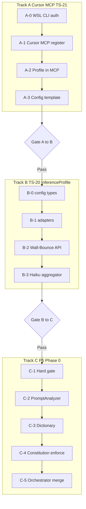
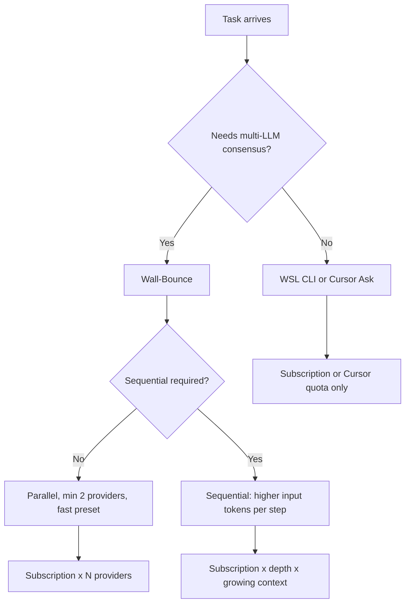

# Phased Execution TODO Runbook

**Status**: ACTIVE — start with Track A; do not skip Gates  
**Owner**: TechSapo Development Team  
**Last updated**: 2026-06-18

Step-by-step checklist for **subscription-quota** development via Cursor MCP and downstream platform work.

> **Full-Fork (primary):** Unified MCP implementation runs in **`techdev-cursor`** fork, not this upstream repo. See [FORK_CURSOR.md](./FORK_CURSOR.md). This Runbook remains the procedure source; execute steps in the **fork clone** (`cwd` = fork root).

| Document | Role |
|----------|------|
| [CURSOR_MCP_PLAN.md](./CURSOR_MCP_PLAN.md) | Policy and phase overview |
| [FORK_CURSOR.md](./FORK_CURSOR.md) | Full-Fork `techdev-cursor` — unified MCP target |
| **This file** | Executable steps, acceptance criteria, Gate reviews |

**Progression rule:** Complete **Track A** → Gate A→B → **Track B** → Gate B→C → **Track C**. At each Gate, review logic and methodology before continuing.

**Gate rule (non-negotiable):** Do **not** skip Gates or reorder A → B → C. Parallel work is allowed only where noted below.

---

## Track priority (DevAssist — 2026-06 review)

**Product goal:** Ship **accurate, low-cost coding assistance in Cursor** first; harden multi-LLM Wall-Bounce platform second.

| Priority | Track | Scope | Start when | Blocks value? |
|----------|-------|--------|------------|---------------|
| **P0** | **A** | WSL CLI auth (A-0) → Cursor MCP register + smoke (A-1) → MCP profile args (A-2) → team template (A-3) | **Now** | **Yes** — primary user-facing path |
| — | **Gate A→B** | G1–G7 + **G-MEM** (Memory substrate ADR) | A complete | Required before B |
| **P1** | **B** | `inference-profiles.json`, Wall-Bounce API profiles, adapter wiring into `wall-bounce-analyzer.ts` | Gate A→B Pass | Yes for unified transport + presets |
| — | **Gate B→C** | Schema boundary, adapter tests, profile on API | B complete | Required before C |
| **P2** | **F** (code) | F-1 validate · F-2 catalog loader · F-12 cost-aware TaskRouter | Gate A→B Pass (F-1/F-2); F-12 with B | No — enhances routing/cost after MCP works |
| **P2** | **E** | OpenAI model ID migration in adapters / `llm-providers.json` | A-2 or B-0 (profiles file) | No — doc catalog already ahead of code |
| **P3** | **C** | P5 Phase 0 — Hard gate, PromptAnalyzer, constitution enforce, orchestrator merge | Gate B→C Pass only | No for daily Cursor dev |
| **P4** | **D** | Tokenizer, response cache, CLI usage metrics | Optional | No |
| **P4** | **F-13** | Batch RAG ingest enrichment | Volume gates only | No |
| **P4** | **P5 Phase 1+** | Grounding, NDL, hybrid RAG, AWS peripheral | After Track C | No |

**Parallel (non-blocking):**

| Work | Notes |
|------|--------|
| **F-7 / F-11** (Cookbook · vendor doc sync) | Doc/catalog enrichment — **does not** replace P0 A-1 registration |
| **TS-21 README maturity bars** | External narrative; separate from execution priority |
| **Plan A doc stubs** | Remove in Plan A P5 when external links expire |

**Dev loop vs constitution (no conflict):**

- **Daily coding in Cursor:** single-provider MCP (`analyze_*`) when one LLM suffices — [README § Processing Flow](./README.md) AS-IS path.
- **Multi-LLM analysis / production API:** Wall-Bounce only — ≥2 providers, 2–5 rounds, thresholds per [AGENTS.md](../AGENTS.md#constitution). Round **enforcement in code** remains **Track C** (To-Be).

Reference: [PROVIDER_INTEGRATION_BACKLOG.md](./PROVIDER_INTEGRATION_BACKLOG.md) · [FORK_CURSOR.md § MCP sequence](./FORK_CURSOR.md#mcp-server-implementation-sequence-fork)

---



---

## How to use

| Symbol | Meaning |
|--------|---------|
| `[ ]` | Not started |
| `[~]` | In progress / partial |
| `[x]` | Done |

Each task block: **Purpose** → **Steps** → **Done when** → **Reflection memo** (fill at Gate).

---

## Current known state (update as you go)

| Item | Status | Notes |
|------|--------|-------|
| `claude` WSL native | `[x]` | Verify in fork clone |
| `codex` WSL native | `[x]` | A-0.2 done — WSL `@openai/codex@0.141.0`; auth symlink `~/.codex/auth.json` → Windows; `codex exec` probe OK |
| `agy` WSL native | `[x]` | A-0.3 done — `~/.local/bin/agy` 1.0.9; OAuth token; `/tmp` + stdin probe OK (~8s) |
| Fork `techdev-cursor` Day 0 | `[x]` | `forkProfile.yaml`, stubs, template, npm script committed |
| A-1 code (adapters + unified MCP) | `[x]` | stdio-safe logging, provider preset models, agy cwd; smoke scripts |
| A-1 Cursor MCP registered | `[~]` | WSL preflight + smoke OK; G1–G6 gate 2026-06-18; **G7 Cursor UI deferred** |
| A-2 InferenceProfile in MCP | `[ ]` | Extend unified MCP tool schemas (not legacy dual servers) |
| A-3 template committed | `[x]` | `config/cursor-mcp.template.json` + `cursor-mcp.windows.template.json` |
| A-3 team registration | `[ ]` | At least one dev registered |
| Track A complete | `[ ]` | A-0 sign-off + A-1 invoke + A-2 + A-3 registration |
| Gate A→B passed | `[ ]` | G1–G6 **Yes** 2026-06-18; **G7 deferred** (Cursor UI invoke — intentional) |
| Track B complete | `[ ]` | B-0 partial: types/resolver exist; WB wiring pending |
| Gate B→C passed | `[ ]` | — |
| Track C complete | `[ ]` | — |

---

## Track A — Cursor MCP only (TS-21)

**Primary repo:** `techdev-cursor` fork — see [FORK_CURSOR.md](./FORK_CURSOR.md).  
**Do not register Cursor MCP until A-0 sign-off is complete.** A-0 complete 2026-06-18 — A-1 unblocked.

### Fork Day 0 (before MCP code)

Complete in **`techdev-cursor`** clone — not upstream `techdev`. See [FORK_CURSOR § Fork bootstrap](./FORK_CURSOR.md#fork-bootstrap-mcp-implementation-ready).

| # | Task | Done when |
|---|------|-----------|
| F1 | GitHub repo `techdev-cursor` + local clone + `upstream` remote | `[ ]` |
| F2 | `git tag fork-base/5cc31f57` (or latest upstream doc commit) | `[ ]` |
| F3 | `forkProfile.yaml` + `config/fork/*.json` stubs | `[ ]` |
| F4 | Unified `config/cursor-mcp.template.json` + `techsapo-providers-mcp` npm script | `[ ]` |
| F5 | README fork-primary banner | `[ ]` |
| F6 | First push to `origin` (`techdev-cursor`) | `[ ]` |

**Then:** Track A-0 (WSL CLI). **Codex WSL install + auth (A-0.2) runs after fork** — avoids mixing upstream git with CLI setup churn.

### A-0: WSL native install + authentication

#### A-0.1 Claude Code (Anthropic MAX / OAuth)

**Purpose:** Peer provider CLI on WSL; MAX subscription via OAuth (not API key billing).

**Steps:**

1. Install (WSL):
   ```bash
   npm install -g @anthropic-ai/claude-code
   ```
2. Auth — pick one:
   - **Option A (symlink from Windows):**
     ```bash
     mkdir -p ~/.claude
     ln -sf /mnt/c/Users/<YOU>/.claude/.credentials.json ~/.claude/.credentials.json
     ```
   - **Option B (WSL login):**
     ```bash
     claude login
     ```
3. Prevent API-key override:
   ```bash
   unset ANTHROPIC_API_KEY
   grep -n ANTHROPIC_API_KEY ~/.bashrc ~/.profile 2>/dev/null || true
   # Remove from shell rc if present
   ```
4. Verify:
   ```bash
   which claude                    # MUST NOT be /mnt/c/.../npm/claude
   claude --version
   claude --print --model sonnet --effort low "Reply with only: ok"
   ```

**Done when:** `[x]` WSL path; `[x]` probe returns `ok` without `ANTHROPIC_API_KEY`.

**Troubleshoot:**

| Symptom | Fix |
|---------|-----|
| `Exec format error` | Using Windows `.exe`; install WSL-native package |
| Timeout / auth error | Refresh symlink or run `claude login` in WSL |
| API charges | Unset `ANTHROPIC_API_KEY` |

**Reflection memo:** _Why OAuth over API key for peer provider? Aligns with [SECURITY.md](./SECURITY.md) and subscription quota goal._

---

#### A-0.2 Codex (OpenAI subscription)

**When:** **After Fork Day 0** (F1–F6). Do not block fork bootstrap on Codex WSL migration.

**Purpose:** GPT-5 / Codex peer provider on WSL for MCP spawn.

**Steps:**

1. Install (WSL — do **not** use Windows npm):
   ```bash
   npm install -g @openai/codex
   ```
2. Auth — pick one:
   - **Option A (symlink from Windows — used 2026-06-18):**
     ```bash
     mkdir -p ~/.codex
     ln -sf /mnt/c/Users/womba/.codex/auth.json ~/.codex/auth.json
     ```
   - **Option B (WSL login):**
     ```bash
     codex login
     test -f ~/.codex/auth.json && echo "codex auth ok"
     ```
3. Verify PATH:
   ```bash
   which codex                     # MUST NOT be /mnt/c/...
   codex --version                 # double hyphen (not -version)
   type -a codex                   # WSL path MUST be first
   ```
4. Non-interactive probe (matches [codex-adapter.ts](../src/adapters/codex-adapter.ts)):
   ```bash
   codex exec -c 'approval_policy="never"' "Reply with only: ok"
   ```

**Done when:** `[x]` `~/.codex/auth.json` exists under WSL home (symlink OK); `[x]` `codex exec` probe succeeds.

**Troubleshoot:**

| Symptom | Fix |
|---------|-----|
| `Missing optional dependency @openai/codex-linux-x64` | Windows npm shim on PATH — use WSL install; `type -a codex` must list `~/.nvm/...` **before** `/mnt/c/...` |
| `Missing optional dependency @openai/codex-linux-x64` (after PATH fix) | Reinstall: `npm install -g @openai/codex@latest` in WSL |
| Windows shim on PATH | Reorder PATH; WSL `~/.nvm/.../bin` before `/mnt/c/...` |
| `gpt-5-codex` not supported (ChatGPT account) | CLI default may use `gpt-5.5`; adapter default model migration is **Track E** — A-0.2 CLI probe uses `codex exec` without forcing `gpt-5-codex` |

**Reflection memo:** _Codex auth file location must match [config/codex-mcp.toml](../config/codex-mcp.toml) `auth_file` (WSL path)._

---

#### A-0.3 Antigravity (`agy`)

**Purpose:** Google Tier 1 peer provider on WSL.

**Steps:**

1. Confirm install:
   ```bash
   which agy                     # expect ~/.local/bin/agy (not /mnt/c/...)
   agy --version                 # e.g. 1.0.9
   type -a agy
   ```
2. Install if missing:
   ```bash
   curl -fsSL https://antigravity.google/cli/install.sh | bash
   ```
3. Auth — **agy 1.0.9 has no `agy auth login` subcommand** (`agy help` lists `models`, `plugin`, `update` only). OAuth is established on first successful CLI use (browser flow) and stored under WSL:
   ```bash
   test -f ~/.gemini/antigravity-cli/antigravity-oauth-token && echo "agy oauth token ok"
   ls -la ~/.gemini/antigravity-cli/antigravity-oauth-token
   ```
   If the token file is missing or stale, run a probe from `/tmp` (step 4) — Antigravity may open a browser for Google OAuth.
4. Non-interactive probe — **must match [agy-adapter.ts](../src/adapters/agy-adapter.ts) / [antigravity-cli.ts](../src/utils/antigravity-cli.ts): prompt via stdin, not as a CLI argument** (long argv hangs; short argv in a git repo triggers agentic workspace exploration):
   ```bash
   cd /tmp
   echo 'Reply with only: ok' | agy --print --model gemini-2.5-flash
   ```
   Expected: stdout is `ok` (or contains `ok`) within ~60s. Bounded smoke test:
   ```bash
   cd /tmp && timeout 60 bash -c 'echo "Reply with only: ok" | agy --print --model gemini-2.5-flash --print-timeout 45s'
   ```
5. Optional — list models (may be slow; use timeout):
   ```bash
   timeout 30 agy models 2>&1 | head -20
   ```

**Done when:** `[x]` WSL binary on PATH; `[x]` `~/.gemini/antigravity-cli/antigravity-oauth-token` exists; `[x]` step 4 probe from **`/tmp`** returns `ok` within 60s (verified 2026-06-18).

**Do not use as A-0.3 pass/fail** (known bad patterns from 2026-06-18):

```bash
# ❌ From repo root — agy explores workspace (list_dir, grep, jest) instead of one-line reply
cd ~/techdev-cursor && agy --print --model gemini-2.5-flash "Reply with only: ok"

# ❌ Prompt as CLI arg in repo — same agent loop even with short prompt
cd ~/techdev-cursor && echo 'Reply with only: ok' | agy --print --model gemini-2.5-flash
```

**Troubleshoot:**

| Symptom | Fix |
|---------|-----|
| Output stops after `agy --version` (probe “hangs”) | Probe still running — use **stdin + `/tmp` cwd** (step 4), not argv from repo root |
| `--print` lists dirs / reads `wall-bounce-analyzer.ts` / runs grep | **Expected in git repo cwd** — rerun from `/tmp`; auth may still be OK |
| `Error: unknown subcommand: auth` | Normal for agy 1.0.9 — use OAuth token file + browser flow on first probe |
| `agy models` hangs | Network or auth; `timeout 30 agy models`; refresh OAuth via probe from `/tmp` |
| Probe times out from `/tmp` | Check token mtime; inspect `~/.gemini/antigravity-cli/log/` or `cli.log` symlink; retry after Google OAuth |
| `Not on PATH` | Ensure `~/.local/bin` in PATH (`agy install` or shell profile) |

**Reflection memo:** _agy is WSL-native; adapter spawns `agy --print --model …` with prompt on stdin ([antigravity-cli.ts](../src/utils/antigravity-cli.ts)). Repo cwd agent behavior is an A-0 probe pitfall, not necessarily an auth failure — Track B may need explicit spawn `cwd` for MCP/Wall-Bounce._

---

#### A-0.4 Common environment checks

**Steps:**

1. Node.js (WSL):
   ```bash
   node --version   # ≥18
   ```
2. PATH hygiene:
   ```bash
   type -a claude codex agy
   ```
3. Project build:
   ```bash
   cd ~/techdev-cursor && npm run build
   ```

**A-0 sign-off (all required before A-1):**

```
[x] claude  — WSL native + OAuth (no ANTHROPIC_API_KEY)
[x] codex   — WSL native + ~/.codex/auth.json (symlink from Windows OK); `codex exec` probe OK
[x] agy     — WSL native + OAuth token; `/tmp` + stdin probe OK (A-0.3)
[x] which claude/codex/agy — WSL paths first (`~/.nvm/...` / `~/.local/bin`; not `/mnt/c/` for default `which`)
[x] npm run build — success
```

**A-0 sign-off complete 2026-06-18** — proceed to A-1 (Cursor MCP registration).

---

### A-1: Cursor MCP registration (Unified — in fork)

**Prerequisite met (A-0 sign-off 2026-06-18)** — register Cursor MCP per steps below. G7 requires three `analyze_*` invokes **from Cursor Agent** after registration.

**Purpose:** Cursor Agent tool calls route to **single unified** MCP server `techsapo-providers` (subscription quota for tool execution).

**Prerequisite:** Fork cloned — [FORK_CURSOR.md](./FORK_CURSOR.md). Work in `~/techdev-cursor`, not upstream `~/techdev`.

**Steps:**

1. Build + WSL preflight (fork):
   ```bash
   cd ~/techdev-cursor && npm run build
   npm run mcp:list-tools-smoke    # stdio JSON-RPC; tools listed without stdout corruption
   npm run g7:adapter-smoke        # optional: same adapter path as MCP (2026-06-18: all OK)
   ```
2. Verify stdio server starts manually (optional):
   ```bash
   node dist/services/techsapo-providers-mcp-server.js
   # Ctrl+C after no startup error; logs → logs/mcp-providers.log
   ```
3. Confirm WSL auth per A-0 (`~/.codex/auth.json`, Claude OAuth, agy OAuth token).
4. **Register MCP** — pick **one**:
   - **WSL Remote** (window URI `vscode-remote://wsl+…`): use repo [`.cursor/mcp.json`](../.cursor/mcp.json) or [config/cursor-mcp.template.json](../config/cursor-mcp.template.json) (`node` + Linux `cwd`) — **not** `wsl.exe`
   - **Windows Cursor host** (folder not Remote): [config/cursor-mcp.windows.template.json](../config/cursor-mcp.windows.template.json)
   - See [CURSOR_MCP_TEMPLATE.md § Which template?](./CURSOR_MCP_TEMPLATE.md#which-template-read-first)
   - Reload MCP → **Connected** → tools: `analyze_claude`, `analyze_codex`, `analyze_agy`
5. **G7 smoke from Cursor Agent** (one invoke each):

| Tool | CallTool args |
|------|----------------|
| `analyze_claude` | `{ "prompt": "Reply with exactly one word: ok", "preset": "fast", "model": "haiku" }` |
| `analyze_codex` | `{ "prompt": "Reply with exactly one word: ok", "preset": "fast", "model": "gpt-5.5" }` |
| `analyze_agy` | `{ "prompt": "You are text-only. Reply with exactly one word: ok", "preset": "fast", "model": "gemini-2.5-flash", "workingDirectory": "/tmp" }` |

**Done when:** `[x]` WSL preflight + adapter smoke; `[ ]` Unified server **Connected** in Windows Cursor; `[ ]` G7 — all three `analyze_*` from Cursor UI.

**Troubleshoot:**

| Symptom | Fix |
|---------|-----|
| `spawn … wsl.exe ENOENT` | **WSL Remote** — remove windows template; use Variant B or `.cursor/mcp.json` |
| `Cannot find module /home/<user>/dist/...` | Relative `args` without effective `cwd` — use **absolute** path in `args` (see `.cursor/mcp.json`) |
| MCP failed to start | Wrong WSL `-d` name (Windows host only); fix PATH in template `bash -lc` line |
| Connected, 0 tools | stdout log corruption — ensure latest server (`configureLoggerForMcpStdio`) |
| `analyze_codex` model error | Use `gpt-5.5` explicitly; default resolver now uses gpt-5.5 for codex |
| `analyze_agy` timeout in repo | Add `workingDirectory: "/tmp"` for short smoke prompts (A-0.3) |

**Reflection memo:** _Cursor Agent planning still uses Cursor quota; MCP tools use subscription — see Token & Quota Operations Guide._

**AS-IS (fork):** Unified server implemented; A-1 ops = Windows template paste + G7 from Cursor UI.

<details>
<summary>Legacy A-1 (dual-server — superseded)</summary>

Previously: separate `techsapo-codex` + `techsapo-claude` via `npm run codex-mcp` / `claude-code-mcp`. Do not use for new registration (`codex-mcp` daemonizes).

</details>

---

### A-2: InferenceProfile in MCP (minimal — Track A scope)

**Purpose:** Pass model / effort / CoT through MCP args (no Wall-Bounce API changes yet — that is Track B).

**Steps:**

1. Extend [techsapo-providers-mcp-server.ts](../src/services/techsapo-providers-mcp-server.ts) tool `inputSchema` — optional `model`, `effort`, `cot` (and Codex `reasoning_effort`).
2. Map args through [src/adapters/](../src/adapters/) (`claude-adapter`, `codex-adapter`, `agy-adapter`) — **not** legacy `claude-code-mcp-server` / dual registration.
3. Manual test from Cursor:
   - Claude: `model: sonnet`, `effort: medium`, `cot: brief`
   - Codex: `reasoning_effort: medium`
4. Document preset mapping table in commit message / Gate memo.

**Done when:** `[ ]` At least one preset-equivalent invoke succeeds per provider via Cursor MCP.

**Reflection memo:** _Keep adapter logic in MCP servers, not in Cursor config — matches TS-20 adapter boundary._

---

### A-3: Unified config template

**Purpose:** Reproducible Cursor MCP registration for the team.

**Steps:**

1. Copy [config/cursor-mcp.template.json](../config/cursor-mcp.template.json); replace `<REPO_ROOT>` and `<USER>`.
2. Optional: symlink into Cursor user config (location varies by Cursor version / WSL).
3. Update this runbook **Known state** when registered.

**Done when:** `[ ]` Template committed; `[ ]` At least one developer registered from template.

**AS-IS:** Template is committed (`[x]`). Registration remains `[ ]` until a developer completes Cursor MCP setup.

---

### Gate A → B (review before Track B)

**Do not start Track B until all Pass conditions are met.**

> **2026-06-18:** G1–G6 verified and marked **Yes**. **G7 intentionally deferred** — complete Cursor UI `analyze_*` ×3 in a separate step after review (adapter smoke already OK).

| # | Criterion (logic / methodology) | Yes | Memo |
|---|----------------------------------|-----|------|
| G1 | **Transport:** MCP stdio matches [TS-17](./decisions/TECH_STACK_LLM_PROVIDER_TRANSPORT.md) (no HTTP between co-located providers) | **Yes** | `techsapo-providers` stdio only; adapters `spawn` CLI — no HTTP in `src/adapters/`; `mcp:list-tools-smoke` OK 2026-06-18 |
| G2 | **Security:** No API keys in code/env for Claude; CLI/OAuth only | **Yes** | `claude-adapter` deletes `ANTHROPIC_API_KEY`; shell unset verified; peer path CLI/OAuth (RAG/OpenAI API paths separate — not MCP peer) |
| G3 | **Quota:** Team understands Cursor Agent vs MCP tool billing | **Yes** | Sign-off 2026-06-18: Agent planning = Cursor quota; MCP `analyze_*` = subscription CLI spawn ([§ Token & Quota](#token--quota-operations-guide)) |
| G4 | **Provider parity:** claude / codex / agy treated as peer Tier 1–3; Opus aggregator-only | **Yes** | Unified MCP exposes only `analyze_claude` / `analyze_codex` / `analyze_agy`; no Opus analyze tool |
| G5 | **Operability:** A-0 steps reproducible on clean WSL | **Yes** | Dev WSL re-verified 2026-06-18: `npm run build`, `type -a` WSL-first paths, three CLIs; clean-room second machine optional |
| G6 | **A-0 sign-off:** All five checkboxes `[x]` | **Yes** | A-0 sign-off block complete 2026-06-18 |
| G7 | **A-1 invoke:** all three `analyze_*` tools succeeded once from Cursor (unified MCP) | | **Deferred** — adapter smoke OK; Cursor UI ×3 intentionally after G1–G6 review |
| G-MEM | **Memory substrate:** [TS-22 v1.3](./decisions/TECH_STACK_MEMORY_SUBSTRATE.md) — Layer A design accepted (schema, TTL, temporal model) | **Yes** | **Closed 2026-06-18** — implementation (M1 store) deferred to Track B |

**Pass when:** G1–G7 and **G-MEM** all Yes. (**G-MEM:** closed 2026-06-18. **G1–G6:** Yes 2026-06-18. **G7:** open — deferred.)

**Gate decision:** `[ ]` Pass → proceed to Track B  /  `[ ]` Fail → fix Track A, re-review

**Reviewer / date:** G-MEM — 2026-06-18 · G1–G6 — verified 2026-06-18 · G7 — pending (Cursor UI)

---

## Memory substrate (Gate prerequisite for Track B)

**G-MEM status:** **Closed 2026-06-18** — TS-22 v1.3 design accepted. `OrchestrationSessionStore` (M1 Redis) and adapter `sessionId` wiring remain **Track B** work; revisit implementation details as needed.

**ADR:** [TECH_STACK_MEMORY_SUBSTRATE.md](./decisions/TECH_STACK_MEMORY_SUBSTRATE.md) (TS-22 v1.3)  
**Gate criterion:** [G-MEM](#gate-a--b-review-before-track-b) — **signed off**  
**Rule:** Track B memory **implementation** follows accepted TS-22; do not add parallel `*-session-manager` silos. Full **Gate A→B** still requires G1–G7.

### Why (one paragraph)

Wall-Bounce and multi-LLM workflows require **durable orchestration transcript** (all rounds × all providers), optional **per-provider session** handles (latency), and **long-term retrieval** (Cipher/RAG). A-1 `analyze_*` is intentionally stateless until Track B connects `sessionId` to Layer A.

### Three layers (summary)

| Layer | Name | Mandatory? | AS-IS |
|-------|------|------------|-------|
| **A** | OrchestrationSession — append-only transcript (`orch:session:*`) | **Yes** | Partial (in-process summaries only; no unified store) |
| **B** | Provider handles in `providerHandles` (`--resume`, `codex-reply`, agy conversation id) | Optional | **Codex-only** [`codex-session-manager.ts`](../src/services/codex-session-manager.ts) — legacy, not final design |
| **C** | Cipher / RAG long-term knowledge | Optional retrieve | Cipher MCP external |

### AS-IS fragmentation (do not extend)

| Module | Problem |
|--------|---------|
| `codex-session-manager.ts` | Codex-only Redis transcript; **not** used by unified `analyze_*` |
| `multi-llm-session-handler.ts` | Misuses CodexSessionManager as sole Wall-Bounce conversation store |
| `session-manager.ts` | App-generic Redis session — separate from orchestration |
| Missing `claude-session-manager` / `agy-session-manager` | **Not** intentional parity gap — do **not** add parallel managers |

**Forbidden (Track B+):** Three independent `*-session-manager.ts` files as parallel sources of truth. Use **one** `OrchestrationSessionStore` + `providerHandles` per TS-22 §2.0.

### Track B memory deliverables (do not skip)

| # | Task | Done when |
|---|------|-----------|
| M1 | `OrchestrationSessionStore` + `orch:session:*` + [orchestration-session.schema.json](../config/schemas/orchestration-session.schema.json) v1.1 | `[~]` Types + schema + [orchestration-memory.json](../config/orchestration-memory.json) done; **Redis store pending** |
| M2 | `sessionId` + `continueProviderSession` on `AdapterRequest` + MCP `analyze_*` schema (A-2 overlap) | `[ ]` Types + schema documented |
| M3 | Wall-Bounce round events append to Layer A | `[ ]` At least one round logged end-to-end |
| M4 | `multi-llm-session-handler` reads/writes Layer A (stop Codex-only store) | `[ ]` B-1 memo + code path identified |
| M5 | `codex-session-manager` migration phases B-M1…B-M5 (TS-22 §3) | `[ ]` Legacy demoted to Layer B helper |
| M6 | Claude / agy `providerHandles` + opt-in continue | `[ ]` Documented in adapter wiring memo |

**AS-IS exception:** Until M2 ships, `analyze_*` without `sessionId` remains valid for smoke tests only — not for production user-facing analysis.

**Reflection memo:** _Layer C (Cipher) retrieves into `context`; it does not replace Layer A. Layer B reduces latency; Layer A remains authoritative._

---

## Track B — InferenceProfile implementation (TS-20)

**Start only after Gate A→B Pass (including G-MEM).**

References: [TECH_STACK_INFERENCE_PROFILES.md](./decisions/TECH_STACK_INFERENCE_PROFILES.md) · [TECH_STACK_MEMORY_SUBSTRATE.md](./decisions/TECH_STACK_MEMORY_SUBSTRATE.md)

### B-0: Config + types

**Purpose:** Single schema for model, effort, CoT, temperature.

**AS-IS:** `src/types/inference-profile.ts` and hardcoded [inference-profile-resolver.ts](../src/adapters/inference-profile-resolver.ts) exist (A-1). Remaining: file-backed presets.

**Steps:**

1. Add `config/inference-profiles.json` with presets: `fast`, `balanced`, `deep`, `critical`.
2. Extend loader: resolve preset → merge overrides (replace hardcode in resolver when ready).
3. JSON Schema under `config/schemas/` (optional same commit).

**Done when:** `[ ]` JSON validates; `[ ]` resolver loads file; `[ ]` no circular deps.

**Verify:**
```bash
npm run build
```

**Reflection memo:** _Presets match [WALL_BOUNCE_SYSTEM.md § Inference Profiles](./WALL_BOUNCE_SYSTEM.md#inference-profiles-model-effort-cot-temperature)._

---

### B-1: Provider adapters (Wall-Bounce wiring)

**Purpose:** Wall-Bounce uses the same adapters as unified MCP; no nested MCP spawn.

**AS-IS:** Standalone adapters in `src/adapters/*` serve unified MCP (A-1). Wall-Bounce still uses legacy spawn paths.

| Provider | Adapter | Wall-Bounce wiring |
|----------|---------|-------------------|
| Claude | [claude-adapter.ts](../src/adapters/claude-adapter.ts) | Replace nested MCP / direct spawn in analyzer |
| Codex | [codex-adapter.ts](../src/adapters/codex-adapter.ts) | Same |
| agy | [agy-adapter.ts](../src/adapters/agy-adapter.ts) | Replace legacy `gemini` spawn where applicable |

**Steps:**

1. Refactor [wall-bounce-analyzer.ts](../src/services/wall-bounce-analyzer.ts) to call adapters.
2. Unit or integration test per adapter path from Wall-Bounce.
3. Deprecate nested MCP client spawn for provider inference.

**Done when:** `[ ]` Wall-Bounce uses adapters; `[ ]` each path has one test or documented manual probe.

**Reflection memo:** _CoT independent of effort — test `effort: high` + `cot: off` case._

---

### B-1 legacy note (superseded paths)

<details>
<summary>Old B-1 file list (legacy MCP servers — do not extend for Cursor)</summary>

| Provider | Legacy file(s) |
|----------|----------------|
| Claude | `claude-code-mcp-server.ts` |
| Codex | `codex-mcp-server.ts`, `codex-gpt5-provider.ts` |

Use adapters only for new work.

</details>

---

### B-2: Wall-Bounce API

**Purpose:** External clients select profile per request.

**Steps:**

1. Extend [wall-bounce-api.ts](../src/routes/wall-bounce-api.ts) request type:
   - `profile?: 'fast' | 'balanced' | 'deep' | 'critical'`
   - `inference?: Partial<Record<string, InferenceProfile>>`
2. Wire into `executeWallBounce` options.
3. Test:
   ```bash
   curl -s -X POST http://localhost:8443/api/v1/wall-bounce/analyze-simple \
     -H 'Content-Type: application/json' \
     -d '{"question":"test","profile":"fast"}' | head
   ```

**Done when:** `[ ]` API accepts profile; `[ ]` at least one provider uses resolved profile.

---

### B-3: Haiku + aggregator preset

**Purpose:** Register Haiku for `fast` preset; pin Opus aggregator to `critical`.

**Steps:**

1. Add Haiku to [llm-providers.json](../src/config/llm-providers.json) and [wall-bounce-analyzer.ts](../src/services/wall-bounce-analyzer.ts).
2. Pin `llm_aggregate` / aggregator path to `critical` preset (Opus, max effort, cot brief).

**Done when:** `[ ]` `fast` can select Haiku; `[ ]` aggregator ignores TaskRouter override for preset.

---

### Gate B → C (review before Track C)

| # | Criterion | Yes | Memo |
|---|-----------|-----|------|
| G1 | **Schema:** effort / cot / temperature independently controllable | | |
| G2 | **Adapter boundary:** No provider-specific flags in orchestrator | | |
| G3 | **Preset consistency:** Matches WALL_BOUNCE_SYSTEM + TS-20 ADR | | |
| G4 | **CoT vs SSE:** UI thinking stream ≠ CoT policy | | |
| G5 | **Doc sync:** ADR, API reference, WALL_BOUNCE_SYSTEM updated | | |
| G6 | **E2E:** One preset works end-to-end (API or MCP) with test record | | |

**Pass when:** G1–G6 all Yes.

**Gate decision:** `[ ]` Pass → proceed to Track C  /  `[ ]` Fail → fix Track B

**Reviewer / date:** _______________

---

## Track C — P5 Phase 0 Platform

**Start only after Gate B→C Pass.**

Reference: [WALL_BOUNCE_P5_ARCHITECTURE.md §4](./decisions/WALL_BOUNCE_P5_ARCHITECTURE.md)

### C-1: Hard gate + confidence

**Purpose:** Block low-quality responses (gap B1).

**Gap:** B1 — fixed confidence values, no hard gate.

**Steps:**

1. Replace fixed confidence with computed scores.
2. Implement hard gate before response return (threshold from constitution: confidence ≥ 0.7, consensus ≥ 0.6).
3. Add tests for reject / escalate paths.

**Done when:** `[ ]` Gate blocks sub-threshold responses in tests.

**Reflection memo:** _Gate runs after Wall-Bounce rounds, not instead of constitution 2–5 rounds._

---

### C-2: PromptAnalyzer + morphological analysis

**Purpose:** Japanese routing accuracy (gaps B5, TS-19).

**Steps:**

1. Select MeCab-class parser (Phase 0 spike).
2. Integrate into PromptAnalyzer (once per request, before Grounding).
3. Feed TaskRouter / dictionary v0 features.

**Done when:** `[ ]` Parse runs on sample Japanese prompts; `[ ]` regex-only path deprecated for routing.

**Reflection memo:** _Parse for routing only — not morpheme substitution of LLM prompts ([P5 §7](./decisions/WALL_BOUNCE_P5_ARCHITECTURE.md#7-形態素解析の位置づけ))._

---

### C-3: Dictionary v0

**Purpose:** Domain term expansion for PromptAnalyzer.

**Steps:**

1. Define dictionary format and location.
2. Wire lookup from morphological parse output.
3. Seed minimal legal/tech terms for testing.

**Done when:** `[ ]` At least one term expands correctly in integration test.

---

### C-4: Constitution round enforce (TS-12)

**Purpose:** Enforce 2–5 rounds in code, not docs only.

**Steps:**

1. Add round counter in `executeWallBounce` (min 2, max 5).
2. Reject single-round execution.
3. Tests: 1 round fails; 2 rounds pass; 6 rounds capped at 5.

**Done when:** `[ ]` Tests prove enforce; `[ ]` matches [AGENTS.md](../AGENTS.md) Constitution.

**Reflection memo:** _Constitution is supreme — implementation must not bypass via API flags._

---

### C-5: Orchestrator merge

**Purpose:** Resolve dual Analyzer / Orchestrator implementations (B3, B8).

**Steps:**

1. Inventory [wall-bounce-analyzer.ts](../src/services/wall-bounce-analyzer.ts) vs [wall-bounce-orchestrator.ts](../src/services/wall-bounce-orchestrator.ts).
2. Choose single entry path for API.
3. Deprecate or adapter-wrap legacy path; update tests.

**Done when:** `[ ]` One canonical path documented; `[ ]` `getProviderOrder` supports TaskRouter policy.

---

### Gate C — P5 Phase 0 complete

| # | Criterion | Yes | Memo |
|---|-----------|-----|------|
| G1 | B1 hard gate implemented | | |
| G2 | B5 morphological path active in PromptAnalyzer | | |
| G3 | Dictionary v0 wired | | |
| G4 | TS-12 constitution rounds enforced in code | | |
| G5 | B3/B8 orchestrator unified | | |
| G6 | Docs + tests synced ([documentation-sync](../.cursor/rules/documentation-sync.mdc)) | | |

**Pass when:** G1–G6 all Yes → **P5 Phase 0 platform complete.**

**Gate decision:** `[ ]` Pass  /  `[ ]` Fail

**Reviewer / date:** _______________

---

## Token & Quota Operations Guide

Cross-cutting guidance for **all Tracks (A/B/C)** and daily development. Optimizes quota use **without** bypassing constitution or Wall-Bounce requirements for production user-facing analysis.

### Scope

- **Quota optimization** — choose the cheapest path that still meets quality and policy.
- **Constitution compliance** — production multi-LLM analysis must use Wall-Bounce (≥2 providers, confidence ≥ 0.7, consensus ≥ 0.6, 2–5 rounds per constitution; round enforcement in code is **To-Be** — Track C / TS-12).
- **AS-IS vs To-Be** — InferenceProfile presets (`fast`, `balanced`, `deep`, `critical`) are documented in [TS-20](./decisions/TECH_STACK_INFERENCE_PROFILES.md); adapter wiring and Haiku registration are **Track B** until Gate B→C passes.

### Three quota buckets

| Bucket | What consumes it | Typical tasks |
|--------|------------------|---------------|
| **1. Cursor Agent** | Chat context, planning, tool selection, long threads | Doc audits, runbook edits, Agent-driven refactors |
| **2. Subscription CLIs** | `claude`, `codex`, `agy` via WSL direct or MCP tool execution | Single-model coding, probes, MCP analyze tools |
| **3. Wall-Bounce multiplier** | Bucket 2 × N providers × rounds × (sequential context growth) | User-facing analysis, consensus-required decisions |

**Important:** Registering MCP (Track A) moves **inference** to subscription quota. It does **not** eliminate Cursor Agent tokens for planning, context, or orchestration around tool calls.

### When to use which path

| Task type | Recommended path | Token note |
|-----------|------------------|------------|
| Docs, grep, small edits | Cursor Ask / local tools | Lowest Cursor Agent use |
| Single-model coding / debug | WSL CLI direct (`claude --print`, `codex`, `agy`) | Subscription only |
| Multi-LLM consensus / user-facing analysis | Wall-Bounce API or MCP-backed Wall-Bounce | Highest cost; constitution applies |

**Do not** route production user-facing analysis through a single CLI or direct LLM call to save tokens. Dev and doc work **may** use CLI direct per [AGENTS.md](../AGENTS.md).

### Wall-Bounce token rules (within constitution)

**Minimum-cost Wall-Bounce path (when quality allows):**

1. **`parallel` mode** (default in `executeWallBounce`) — each provider receives the same prompt; you pay N provider outputs, not growing input context.
2. **Minimum providers** — use **2** peer providers when thresholds are met; do not add providers without justification.
3. **Stop when thresholds met** — confidence ≥ 0.7 and consensus ≥ 0.6; avoid extra constitution rounds unless quality requires them.
4. **Avoid `sequential` mode** unless chain reasoning is required — each step appends prior provider output to the next prompt, so **input tokens grow per step**. Sequential `depth` defaults to **3** (valid range 3–5); `depth` is ignored in parallel mode.

**Hard limits (do not violate to save tokens):**

- Do **not** reduce below **2 providers** on Wall-Bounce production paths.
- Do **not** use **1 round** for Wall-Bounce production paths (constitution forbids single-round execution; TS-12 enforcement pending).
- Constitution **2–5 rounds** is the legal band until Track C implements the orchestrator counter — treat rounds beyond what quality needs as **voluntary cost**.



### InferenceProfile levers (TS-20)

| Lever | Token impact | Guidance |
|-------|--------------|----------|
| **`model`** | High — smaller/faster models cost less | Prefer Haiku / Flash under `fast` when quality allows (**To-Be** until Track B-3) |
| **`effort`** | Medium — higher effort → longer internal reasoning | Use `low` / `medium` for routine tasks |
| **`cot`** | Medium–high — `full` adds visible reasoning tokens | Default **`cot: off`** for `fast`; **`effort: high` + `cot: off`** is valid (effort ≠ CoT) |
| **`temperature`** | Low direct impact | Keep preset defaults unless domain requires override |

**Preset defaults** (from [TS-20](./decisions/TECH_STACK_INFERENCE_PROFILES.md)):

| Preset | Typical use | CoT |
|--------|-------------|-----|
| `fast` | Classification, short Q&A | off |
| `balanced` | Default implementation | brief |
| `deep` | Complex analysis | brief / full |
| `critical` | Aggregator (`llm_aggregate`) | brief (pinned) |

**AS-IS (before Gate B→C):** presets are documented; use CLI flags or MCP args manually. Do **not** assume `profile: fast` on the Wall-Bounce API selects Haiku until Track B-2/B-3 is complete.

**Escalation path:** start `fast` or `balanced` → if confidence or consensus fails thresholds, escalate to `deep` / higher effort / `cot: brief` — not the reverse.

### Cursor-specific habits

- Start a **new chat** for large doc audits or long runbook sessions to limit context accumulation.
- Prefer **Ask mode** for read-only questions; reserve **Agent** for edits that need tools.
- After Track A-1, use MCP tools for provider inference; keep Agent prompts concise (goal + constraints, not full doc dumps).
- Gate A→B criterion **G3** requires the team to understand **Cursor Agent vs MCP tool billing** — revisit this section at that Gate.

### Quick checklist (before a heavy task)

- [ ] Does this need Wall-Bounce, or is a single WSL CLI enough?
- [ ] If Wall-Bounce: **parallel** + **min 2 providers** + **`fast` or `balanced`** preset (when Track B live)?
- [ ] Is **sequential** depth (3–5) justified by chain reasoning needs?
- [ ] Is **`cot: full`** necessary, or will `off` / `brief` meet the bar?
- [ ] New Cursor chat if context is already large?

### Related references

- [TECH_STACK_INFERENCE_PROFILES.md](./decisions/TECH_STACK_INFERENCE_PROFILES.md) — schema, presets, CoT independence
- [WALL_BOUNCE_SYSTEM.md](./WALL_BOUNCE_SYSTEM.md) — execution modes, quality thresholds
- [CURSOR_MCP_PLAN.md](./CURSOR_MCP_PLAN.md) — MCP phases and quota expectations
- [DEVELOPMENT_GUIDE.md § WSL Native CLI](./DEVELOPMENT_GUIDE.md#wsl-native-cli-prerequisites-cursor-mcp-phase-0) — CLI direct usage

---

## Related documents

| Doc | Link |
|-----|------|
| Plan overview | [CURSOR_MCP_PLAN.md](./CURSOR_MCP_PLAN.md) |
| Full-Fork primary | [FORK_CURSOR.md](./FORK_CURSOR.md) |
| Token & quota ops | [§ Token & Quota Operations Guide](#token--quota-operations-guide) (this file) |
| WSL CLI quick ref | [DEVELOPMENT_GUIDE.md § WSL Native CLI](./DEVELOPMENT_GUIDE.md#wsl-native-cli-prerequisites-cursor-mcp-phase-0) |
| InferenceProfile ADR | [TECH_STACK_INFERENCE_PROFILES.md](./decisions/TECH_STACK_INFERENCE_PROFILES.md) |
| P5 architecture | [WALL_BOUNCE_P5_ARCHITECTURE.md](./decisions/WALL_BOUNCE_P5_ARCHITECTURE.md) |
| MCP architecture | [MCP_SERVICES.md](./MCP_SERVICES.md) |
| Backlog TS-21 | [TECH_STACK_WORKSPACE.md](./TECH_STACK_WORKSPACE.md) |

---

## Out of scope (this runbook)

- PPTX updates
- P5 Phase 1+ (Grounding, AWS, NDL)
- Auto-routing shell script (by design — use presets + TaskRouter)
- **Track D** (tokenizer / response cache) — **LOW PRIORITY**; see [FORK_CURSOR.md](./FORK_CURSOR.md#track-d-low-priority)
