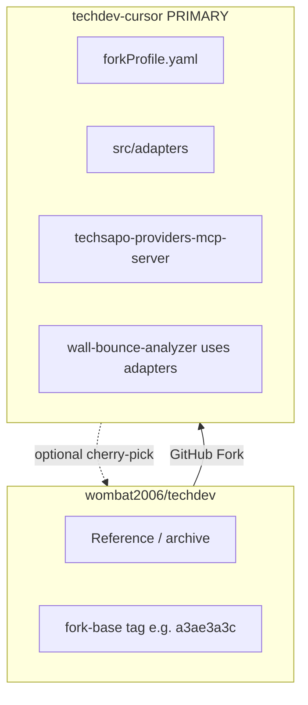

# Full-Fork: techdev-cursor (Primary Development)

**Status**: ACCEPTED — implementation target is the fork, not this upstream repo  
**Owner**: TechSapo Development Team  
**Last updated**: 2026-06-18 (Fork schemas + MCP bootstrap)

## Repository identity

**`techdev-cursor`** is an **integrated Cursor IDE development-environment project**. It was created by forking upstream **`techdev`** — the TechSapo platform that implements the **Wall-Bounce** multi-LLM analysis system.

| Aspect | Definition |
|--------|------------|
| **Origin** | GitHub fork of `wombat2006/techdev` (Wall-Bounce engine, SSE/API, provider tiers) |
| **Purpose** | Build an integrated dev environment in Cursor to **improve coding accuracy** and **reduce coding workload** (WSL CLIs, unified stdio MCP, adapter layer, multi-LLM review) |
| **Not** | An **IT incident/troubleshooting analysis** project — that specialization is the upstream **InfraOps** fork line, not this repo |
| **Also not** | A drop-in replacement for upstream production ops — Wall-Bounce API remains in-tree for dev/analysis workflows |
| **Upstream role** | Reference / optional cherry-pick (`fork_primary` model) |

**Upstream (reference):** `wombat2006/techdev` — platform docs and P5 architecture archive.  
**Primary (this fork):** `techdev-cursor` — Cursor-integrated coding environment (DevAssist line).

Related: [CURSOR_MCP_PLAN.md](./CURSOR_MCP_PLAN.md) · [CURSOR_MCP_TODO.md](./CURSOR_MCP_TODO.md) · [CURSOR_MCP_TEMPLATE.md](./CURSOR_MCP_TEMPLATE.md) · [MCP_SERVICES.md](./MCP_SERVICES.md) · [P5 §9 Forkable core](./decisions/WALL_BOUNCE_P5_ARCHITECTURE.md#9-フォーク可能コア) · [TS-20 InferenceProfile](./decisions/TECH_STACK_INFERENCE_PROFILES.md)

---

## Decisions (locked)

| # | Choice |
|---|--------|
| D1 | MCP topology | **Unified** — single `techsapo-providers` stdio server |
| D2 | Repo model | **Full-Fork** — entire `techdev` tree (not slim repo) |
| D3 | Fork name | **`techdev-cursor`** — integrated Cursor dev environment (coding accuracy + workload reduction; not InfraOps/incident analysis) |
| D4 | Upstream sync | **fork_primary** — fork is primary; upstream is reference |
| D5 | Merge-back | **Optional** — cherry-pick to upstream if needed; not on critical path |

---

## Repository layout



---

## Fork setup

1. GitHub: **Fork** `wombat2006/techdev` → `wombat2006/techdev-cursor`
2. Clone to WSL: `/home/<user>/techdev-cursor`
3. Add remote: `git remote add upstream git@github-techdev:wombat2006/techdev.git`
4. Tag fork base: `git tag fork-base/d5b96b2f` (or latest upstream doc commit)
5. Update fork `README.md`: **PRIMARY — Cursor MCP / DevAssist line**; link upstream
6. Optional: set `package.json` `name` to `techdev-cursor`
7. Complete **[Fork bootstrap (MCP implementation ready)](#fork-bootstrap-mcp-implementation-ready)** — config stubs + directory layout before coding

Canonical `forkProfile.yaml` and stub JSON: see [Fork schemas § Tier 0](#tier-0--fork-day-0-required).

---

## Unified MCP (target architecture)

Single stdio server — **not** dual `techsapo-codex` + `techsapo-claude` registration.

| Tool | Provider | Cursor-safe defaults |
|------|----------|----------------------|
| `analyze_claude` | Claude MAX/OAuth | `--print`, `--strict-mcp-config`, unset `ANTHROPIC_API_KEY` |
| `analyze_codex` | Codex subscription | `codex exec`, non-interactive, `approval_policy=never` |
| `analyze_agy` | Antigravity | `agy --print` |

**Cursor config** (fork clone path; use `node` directly — **not** `npm run codex-mcp`, which daemonizes):

```json
{
  "mcpServers": {
    "techsapo-providers": {
      "command": "node",
      "args": ["dist/services/techsapo-providers-mcp-server.js"],
      "cwd": "/home/<user>/techdev-cursor"
    }
  }
}
```

**New modules (in fork):**

- `src/adapters/{types,claude,codex,agy,inference-profile-resolver}.ts`
- `src/services/techsapo-providers-mcp-server.ts`
- npm script: `techsapo-providers-mcp`

Adapters spawn CLIs only — **no nested MCP**. Wall-Bounce orchestrator refactors to use the same adapters (Track B in fork).

Token & quota: [CURSOR_MCP_TODO § Token & Quota Operations Guide](./CURSOR_MCP_TODO.md#token--quota-operations-guide). Production user-facing multi-LLM analysis uses **Wall-Bounce API**, not chained `analyze_*` tools in Cursor.

---

## Tracks (fork timeline)

| Track | Scope | Priority |
|-------|-------|----------|
| **A-0** | WSL native CLI + auth | Required before MCP register |
| **A-1** | Unified MCP + adapters | **High** |
| **A-2** | InferenceProfile in MCP tool schemas | High |
| **A-3** | Cursor template + team registration | High |
| **Gate A→B** | stdio, quota understanding, 3 tools from Cursor, adapters in orchestrator | Gate |
| **B** | `inference-profiles.json`, Wall-Bounce API profile, remove nested MCP | High |
| **C** | P5 Phase 0 (TS-12, morphological, etc.) | Per Runbook |
| **D** | Tokenizer / usage metrics + response cache | **LOW — after Gate A→B** |

### Track D (LOW PRIORITY)

Not on Gate A→B critical path. Helps subscription-CLI observability (buckets 2–3), **not** Cursor Agent tokens (bucket 1).

| Item | When |
|------|------|
| Response cache (5min in-memory, opt-in) | Track D; optional minimal in A-1 |
| CLI usage parse + Prometheus | Track D |
| Pre-flight prompt size warn (char/4 OK initially) | Track D |
| Provider native prompt cache | Future / optional |

Higher ROI for token savings: InferenceProfile (`fast`, `cot: off`), Ask vs Agent, new chat, single CLI vs Wall-Bounce.

---

## Gate A→B (fork-local)

| # | Criterion |
|---|-----------|
| G1 | stdio transport only (TS-17) |
| G3 | Team understands Cursor Agent vs MCP tool billing |
| G7 | All three `analyze_*` tools succeed from Cursor |
| G-MEM | [TS-22 Memory substrate v1.3](./decisions/TECH_STACK_MEMORY_SUBSTRATE.md) — **closed 2026-06-18** (design); M1 store Track B |
| G8 | `wall-bounce-analyzer` uses adapters (no nested MCP) |
| G9 | `forkProfile.yaml`, `config/fork/` stubs, bootstrap layout — see [Fork bootstrap](#fork-bootstrap-mcp-implementation-ready) | |

---

## fork_primary governance

| Topic | Rule |
|-------|------|
| Default clone | `techdev-cursor` for Cursor MCP work |
| upstream `techdev` | Read-only reference; tag sync points |
| PRs | Target fork `master` |
| Cursor `cwd` | Fork repo root |

---

## Fork bootstrap (MCP implementation ready)

After GitHub Fork + clone, create the following **in the fork** so Track A-1 (Unified MCP) can start immediately. Upstream does not contain these files yet — the fork owns implementation.

### Directory layout (fork)

```
techdev-cursor/
├── forkProfile.yaml
├── config/
│   ├── cursor-mcp.template.json       # unified — see CURSOR_MCP_TEMPLATE.md
│   ├── inference-profiles.json        # Track A-2+ (stub OK for A-1)
│   ├── llm-model-catalog.json         # TS-21 multi-vendor model traits
│   ├── schemas/                       # JSON Schema for config validation
│   │   ├── fork-profile.schema.json
│   │   ├── inference-profiles.schema.json
│   │   ├── llm-model-catalog.schema.json
│   │   ├── task-router.schema.json
│   │   ├── dictionary-v0.schema.json
│   │   └── llm-providers.schema.json
│   └── fork/
│       ├── devassist-task-router.json     # stub — DevAssist coding bias
│       ├── devassist-dictionary-v0.json   # stub — minimal terms
│       └── disclaimer-devassist.json      # stub — dev output disclaimer
├── src/
│   ├── types/
│   │   ├── inference-profile.ts
│   │   ├── llm-model-catalog.ts       # TS-21
│   │   └── adapter-types.ts
│   ├── adapters/
│   │   ├── types.ts
│   │   ├── inference-profile-resolver.ts
│   │   ├── claude-adapter.ts
│   │   ├── codex-adapter.ts
│   │   └── agy-adapter.ts
│   └── services/
│       └── techsapo-providers-mcp-server.ts
└── tests/
    └── adapters/                        # smoke tests per adapter
```

### Fork Day 0 checklist (before coding MCP)

| # | Action | Blocks |
|---|--------|--------|
| 1 | Fork + clone + `upstream` remote + `fork-base/d5b96b2f` tag (or latest) | — |
| 2 | Commit `forkProfile.yaml` (below) | Gate G9 |
| 3 | Create `config/fork/*.json` stubs (below) | TaskRouter / dictionary loaders later |
| 4 | Replace `config/cursor-mcp.template.json` with unified template | Cursor register |
| 5 | Add npm script `techsapo-providers-mcp` → `node dist/services/techsapo-providers-mcp-server.js` | MCP start |
| 6 | **After fork:** [A-0.2 Codex WSL化](./CURSOR_MCP_TODO.md#a-02-codex-openai-subscription) + [A-0.3 agy WSL probe](./CURSOR_MCP_TODO.md#a-03-antigravity-agy) | Live provider calls (not blocking Day 0) |

### package.json scripts (fork)

Add to fork `package.json`:

```json
{
  "scripts": {
    "techsapo-providers-mcp": "node dist/services/techsapo-providers-mcp-server.js",
    "validate:config": "node scripts/validate-fork-config.js"
  }
}
```

`validate:config` is optional at first; add when `config/schemas/` exists (ajv or similar).

---

## Fork schemas

Upstream has **no JSON Schema files** today. The fork introduces `config/schemas/` as the validation layer. TypeScript types in `src/types/` must stay aligned with these schemas.

### Tier 0 — Fork Day 0 (required)

| Schema / file | Format | Purpose |
|---------------|--------|---------|
| **`forkProfile.yaml`** | YAML | Fork manifest — paths to swappable config |
| **`fork-profile.schema.json`** | JSON Schema | Validate `forkProfile.yaml` |
| **`config/cursor-mcp.template.json`** | JSON | Unified Cursor MCP registration |
| **`adapter-types.ts`** | TypeScript | `AdapterRequest`, `AdapterResult`, spawn options |

#### forkProfile.yaml (commit in fork root)

```yaml
id: devassist-cursor
displayName: TechSapo DevAssist (Cursor MCP)
description: Cursor IDE integration via unified provider MCP + subscription quota

inherits:
  - wall-bounce-engine
  - sse-api
  - inference-profiles-ts20

swappable:
  taskRouterRules: config/fork/devassist-task-router.json
  dictionary: config/fork/devassist-dictionary-v0.json
  groundingProviders: config/fork/grounding-providers.json
  disclaimer: config/fork/disclaimer-devassist.json

cursorMcp:
  server: techsapo-providers
  template: config/cursor-mcp.template.json
  entrypoint: dist/services/techsapo-providers-mcp-server.js
  primaryUse: single-provider dev tasks
  productionAnalysis: wall-bounce-api
```

Note: `groundingProviders` as empty file `[]` satisfies TS-18 degraded mode until Track C.

#### config/fork stubs (minimal — copy into fork)

**`config/fork/devassist-task-router.json`**

```json
{
  "version": "1",
  "defaults": {
    "llm_analyze": "balanced",
    "llm_codegen": "fast",
    "llm_agent_edit": "balanced",
    "llm_aggregate": "critical"
  },
  "rules": [
    { "kind": "llm_codegen", "preset": "fast", "pinnedProviders": ["gpt-5-codex"] },
    { "kind": "llm_agent_edit", "preset": "balanced", "pinnedProviders": ["sonnet-4.5"] },
    { "kind": "llm_aggregate", "preset": "critical", "pinnedProviders": ["opus-4.1"], "requiresWallBounce": true }
  ]
}
```

**`config/fork/devassist-dictionary-v0.json`**

```json
{
  "version": "0",
  "terms": [
    { "key": "wb", "expansion": "Wall-Bounce", "domain": "platform" },
    { "key": "mcp", "expansion": "Model Context Protocol", "domain": "platform" }
  ]
}
```

**`config/fork/disclaimer-devassist.json`**

```json
{
  "id": "devassist",
  "locale": "ja",
  "banner": "DevAssist — development assistance only. Not legal or production advice.",
  "showOnCursorMcp": false
}
```

**`config/fork/grounding-providers.json`**

```json
[]
```

---

### Tier 1 — Track A-1 / A-2 (Unified MCP)

| Schema | Format | Purpose |
|--------|--------|---------|
| **`InferenceProfile`** | TS + `inference-profiles.schema.json` | model, effort, cot, temperature ([TS-20](./decisions/TECH_STACK_INFERENCE_PROFILES.md)) |
| **`LlmModelCatalog`** | TS + `llm-model-catalog.schema.json` | vendor/model static traits ([TS-21](./decisions/TECH_STACK_LLM_MODEL_CATALOG.md)) |
| **`config/llm-model-catalog.json`** | JSON | Canonical capability catalog |
| **`config/inference-profiles.json`** | JSON | Preset library (`fast`, `balanced`, `deep`, `critical`) |
| **MCP tool `inputSchema`** | JSON Schema (in server) | `analyze_claude`, `analyze_codex`, `analyze_agy` CallTool args |

**Shared MCP tool input (all three `analyze_*` tools):**

```typescript
interface AnalyzeToolInput {
  prompt: string;
  context?: string;
  preset?: 'fast' | 'balanced' | 'deep';
  model?: string;
  effort?: string;
  cot?: 'off' | 'brief' | 'full';
  temperature?: number;
  workingDirectory?: string;
}
```

**`config/inference-profiles.json` stub (Track A-2; resolver may hardcode until then):**

```json
{
  "version": "1",
  "presets": {
    "fast": { "model": "gemini-2.5-flash", "effort": "low", "temperature": 0.2, "cot": "off" },
    "balanced": { "model": "sonnet", "effort": "medium", "temperature": 0.5, "cot": "brief" },
    "deep": { "model": "sonnet", "effort": "high", "temperature": 0.3, "cot": "brief" },
    "critical": { "model": "opus", "effort": "max", "temperature": 0.2, "cot": "brief" }
  },
  "perProviderDefaults": {
    "claude": { "preset": "balanced" },
    "codex": { "preset": "balanced" },
    "agy": { "preset": "fast" }
  }
}
```

Model aliases resolve in adapters (e.g. `sonnet` → `claude-sonnet-4-5-20250929`).

---

### Tier 2 — Track B (Wall-Bounce integration)

| Schema | Purpose |
|--------|---------|
| **`WallBounceAnalyzeRequest` extension** | Add `profile`, `inference` to API ([TS-20 §2.5](./decisions/TECH_STACK_INFERENCE_PROFILES.md)) |
| **`src/config/llm-providers.json` update** | Add `agy`, Haiku; keep Opus aggregator-only |
| **`llm-providers.schema.json`** | Validate provider registry |

---

### Tier 3 — Track C (P5 Phase 0)

| Schema | Purpose |
|--------|---------|
| **`ChildTask` / `ChildTaskKind`** | P5 §6.3 — Orchestrator task graph |
| **Dictionary v0 full schema** | Morphological parse → term expansion |
| **Grounding provider registry** | When enabling Tier 0–2 sources |

---

### Tier 4 — LOW PRIORITY (Track D)

| Schema | Purpose |
|--------|---------|
| **`UsageRecord`** | CLI usage metrics, Prometheus |
| **`CacheEntry`** | Opt-in response cache (5min TTL) |

Not required for Gate A→B.

---

## MCP server implementation sequence (fork)

Execute in the fork repo after Fork Day 0 checklist. **Priority:** [CURSOR_MCP_TODO § Track priority](./CURSOR_MCP_TODO.md#track-priority-devassist--2026-06-review) — finish **Track A** (Cursor register) before **Track B** wiring.


| Step | Task | Output |
|------|------|--------|
| 1 | `src/types/inference-profile.ts`, `adapter-types.ts` | Shared types |
| 2 | `src/adapters/inference-profile-resolver.ts` | preset → profile (hardcode OK initially) |
| 3 | `src/adapters/claude-adapter.ts` | `claude --print`, no `ANTHROPIC_API_KEY`, `--strict-mcp-config` |
| 4 | `src/adapters/codex-adapter.ts` | `codex exec`, non-interactive |
| 5 | `src/adapters/agy-adapter.ts` | `agy --print` |
| 6 | `src/services/techsapo-providers-mcp-server.ts` | stdio MCP; tools: `analyze_claude`, `analyze_codex`, `analyze_agy` |
| 7 | `npm run build` | `dist/services/techsapo-providers-mcp-server.js` |
| 8 | Manual stdio test | `ListTools` + one `CallTool` per provider |
| 9 | Cursor MCP register | [CURSOR_MCP_TEMPLATE.md](./CURSOR_MCP_TEMPLATE.md) |
| 10 | Track B | Wire adapters into `wall-bounce-analyzer.ts`; remove nested MCP client |

### Adapter hard rules (implementation)

- **Spawn CLI only** — never spawn another MCP server from adapters
- **Claude:** delete `ANTHROPIC_API_KEY` from env; use `--print` single-shot
- **Codex:** never interactive mode from Cursor path
- **Errors:** return MCP `isError: true` with stderr excerpt; no secrets in logs

### Legacy servers in fork (do not use for Cursor)

| File | Fork role |
|------|-----------|
| `claude-code-mcp-server.ts` | Deprecated for Cursor; remove after adapter parity |
| `codex-mcp-server.ts` | Ops/daemon only (`npm run codex-mcp`); **not** Cursor entry |
| `scripts/start-codex-mcp.sh` | Daemon — breaks stdio; do not point Cursor here |

---

## Schema ↔ Track matrix

| File | Tier | Track | Gate |
|------|------|-------|------|
| `forkProfile.yaml` | 0 | Fork Day 0 | G9 |
| `config/fork/*.json` stubs | 0 | Fork Day 0 | — |
| `cursor-mcp.template.json` | 0 | A-1 | G7 |
| `src/adapters/*` | 1 | A-1 | G7, G8 |
| `techsapo-providers-mcp-server.ts` | 1 | A-1 | G7 |
| `inference-profiles.json` | 1 | A-2 | — |
| MCP tool `inputSchema` | 1 | A-2 | — |
| `llm-providers.json` + schema | 2 | B | G8 |
| Usage/cache schema | 4 | D | — |

---

## What stays in upstream (this repo)

- Architecture ADRs, Runbook structure, Token Guide
- P5 proposal and platform documentation
- Optional cherry-pick of doc fixes from fork

Implementation code for Unified MCP and adapters is **not** developed on upstream master until optionally merged back from fork.
