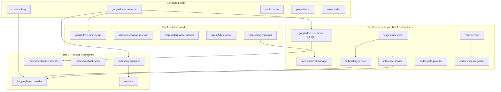

# SRP Refactor — Dependency Order

**Status:** Active (2026-06-22)  
**Companion:** [SRP_MONOLITH_REFACTOR.md](./SRP_MONOLITH_REFACTOR.md) (per-file split record)  
**Audience:** Maintainers planning the next splits

---

## 1. Scope: TypeScript vs JavaScript

| Location | TS | JS | Notes |
|----------|----|----|-------|
| `src/` | 156 | 0 | All application code is TypeScript |
| `scripts/` | (in repo total) | 3 | `g7-adapter-smoke.js`, `mcp-list-tools-smoke.js`, `production-monitoring.js` — **out of SRP scope** (standalone scripts) |

Dependency analysis for refactor ordering uses **`src/**/*.ts` import graph** only. Relative imports (`./`, `../`) are resolved to files; npm packages are external leaves.

---

## 2. Methodology

1. List files ≥ 350 lines not yet under a module directory.
2. Build directed graph: **A → B** means file A imports file B.
3. **Topological order:** refactor **dependencies before dependents** (leaves first).
4. **Shim last:** keep public path stable; split into `src/<area>/` + thin re-export.
5. **Clusters:** group files that share a domain (Google Drive RAG, Hugging Face, MCP governance).

Tools used:

```bash
# Line inventory
find src -name '*.ts' -exec wc -l {} + | sort -rn

# Typecheck after each split
npx tsc --noEmit

# Module tests
npm test -- --testPathPattern="…-modules" --forceExit
```

---

## 3. Dependency clusters (remaining work)



---

## 4. Refactor order (recommended)

### Phase 0 — Done ✅

| Order | Monolith | Module dir | Lines (max module) |
|-------|----------|------------|-------------------|
| — | `wall-bounce-analyzer.ts` | `services/wall-bounce/` | 282 |
| — | `codex-mcp-server.ts` | `services/codex-mcp/` | 416 |
| — | `file-type-detector.ts` | `utils/file-type-detector/` | 482 |
| — | `log-analyzer.ts` | `services/log-analyzer/` | 359 |
| — | `mcp-integration-service.ts` | `services/mcp-integration/` | 183 |
| — | `prometheus-client.ts` | `metrics/prometheus/` | 147 |
| — | `wall-bounce-server.ts` | `wall-bounce-server/` | 139 |
| — | `index.ts` | `server/` | 141 |

### Phase 1 — Done ✅ (dependency roots)

| Order | Monolith | Module dir | Why first |
|-------|----------|------------|-----------|
| 1 | `googledrive-connector.ts` (792) | `services/googledrive-connector/` | **Zero in-repo deps**; imported by RAG routes, webhooks, push-setup |
| 2 | `cost-tracking.ts` (437) | `services/cost-tracking/` | **Leaf**; only consumer is `huggingface-controller` |

**googledrive-connector modules:**

| File | Lines | Responsibility |
|------|-------|----------------|
| `download-document.ts` | 173 | Drive download (arraybuffer / streaming) |
| `rag-search.ts` | 194 | `searchRAG`, `searchWithMCP` |
| `vector-store.ts` | 159 | Vector store CRUD |
| `sync-operations.ts` | 148 | Folder / ID sync batches |
| `connector.ts` | 96 | `GoogleDriveRAGConnector` facade |
| `list-documents.ts` | 60 | `listDocuments` |
| `types.ts` | 28 | Config + document types |

**cost-tracking modules:**

| File | Lines | Responsibility |
|------|-------|----------------|
| `service.ts` | ~385 | `CostTrackingService` class |
| `model-pricing.ts` | ~35 | Default pricing + `calculateModelCost` |
| `types.ts` | ~27 | `CostSummary`, `BudgetAlert` |

### Phase 2 — Complete

| Priority | File | Lines | Status |
|----------|------|-------|--------|
| 1 | `mcp-config-manager.ts` | 392 | ✅ → `mcp-config-manager/` |
| 2 | `ultra-conservative-monitor.ts` | 579 | ✅ → `ultra-conservative-monitor/` |
| 3 | `mcp-performance-monitor.ts` | 543 | ✅ → `mcp-performance-monitor/` |
| 4 | `srp-safety-monitor.ts` | 424 | ✅ → `srp-safety-monitor/` |
| 5 | `googledrive-push-setup.ts` | 540 | ✅ → `googledrive-push-setup/` |

### Phase 3 — In progress

| Priority | File | Lines | Depends on | Status |
|----------|------|-------|------------|--------|
| 1 | `mcp-approval-manager.ts` | 463 | `mcp-config-manager` ✅ | ✅ → `mcp-approval-manager/` |
| 2 | `huggingface-client.ts` | 297 | — | ✅ → `huggingface-client/` |
| 3 | `embedding-service.ts` | 387 | `huggingface-client` ✅ | ✅ → `embedding-service/` |
| 4 | `inference-service.ts` | 559 | `huggingface-client` ✅ | ✅ → `inference-service/` |
| 5 | `googledrive-webhook-handler.ts` | 589 | `googledrive-connector` ✅ | pending |
| 6 | `codex-gpt5-provider.ts` | 410 | timeout handler | pending |
| 7 | `redis-service.ts` | 303 | — | pending |
| 8 | `codex-mcp-integration.ts` | 566 | `redis-service` | pending |
| 9 | `utils/migrate-to-redis.ts` | 559 | `redis-service` | pending |

### Phase 4 — Routes & controllers (last)

| Priority | File | Lines | Depends on |
|----------|------|-------|------------|
| 1 | `controllers/huggingface-controller.ts` | 478 | cost-tracking ✅, embedding, inference |
| 2 | `routes/rag-endpoint.ts` | 445 | googledrive-connector ✅ |
| 3 | `routes/webhook-endpoints.ts` | 451 | webhook-handler |
| 4 | `routes/webhook-setup.ts` | 413 | push-setup |
| 5 | `server.ts` | 352 | rag-endpoint, multiple routes |

> **Rule:** Do not split `routes/*` before their `services/*` dependencies — route files stay thin re-wiring layers.

---

## 5. Import graph rules for agents

1. **Never import the shim from inside the same module tree** — use `./<module>/index` or sibling files (avoids cycles). See `file-type-detector.ts` pattern.
2. **Class facades** may delegate to pure functions `(drive, openai, …)` — see `googledrive-connector/connector.ts`.
3. **Constitution path** `wall-bounce-analyzer.ts` remains shim-only.
4. **Legacy RAG** `googledrive-connector` is AS-IS in this repo; platform delegation per [RAG_SETUP_GUIDE.md](./RAG_SETUP_GUIDE.md) — refactor for maintainability only, not new features.

---

## 6. Verification per phase

```bash
npx tsc --noEmit
npm test -- --testPathPattern="wall-bounce|opus-aggregate|codex-mcp-modules|file-type-detector|log-analyzer-modules|mcp-integration-modules|mcp-config-manager-modules|mcp-approval-manager-modules|huggingface-client-modules|embedding-service-modules|inference-service-modules|ultra-conservative-monitor-modules|mcp-performance-monitor-modules|srp-safety-monitor-modules|googledrive-push-setup-modules|prometheus-wall-bounce|server-modules|googledrive-cost-tracking" --forceExit
```

---

## 7. Changelog

| Date | Change |
|------|--------|
| 2026-06-23 | `inference-service/` split (Phase 3 #4) |
| 2026-06-23 | `embedding-service/` split (Phase 3 #3) |
| 2026-06-23 | `huggingface-client/` split (Phase 3 #2) |
| 2026-06-23 | `mcp-approval-manager/` split (Phase 3 #1) |
| 2026-06-23 | `googledrive-push-setup/` split (Phase 2 #5) |
| 2026-06-23 | `srp-safety-monitor/` split (Phase 2 #4) |
| 2026-06-23 | Doc sync: README, ARCHITECTURE, DEVELOPMENT_GUIDE, TESTING_GUIDE, FORK_STATUS en/ja |
| 2026-06-22 | Initial dependency order; Phase 0–1 complete (10 monoliths split) |
