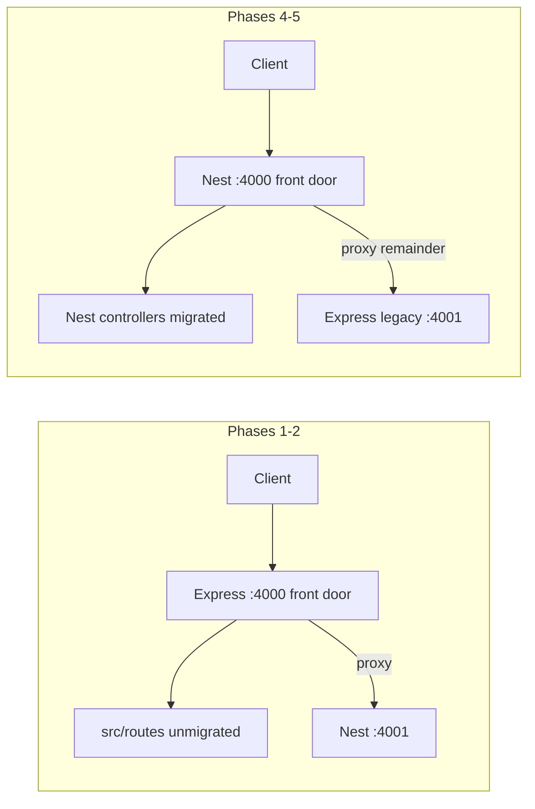

# Idea: Gradual NestJS Strangler Migration (HTTP Layer Only)

**Status:** **Idea only** — evaluate for **effectiveness** and **low-cost implementability**; not Accepted, not Implemented, no code obligation  
**Workspace ID (reserved):** TS-29 (if promoted to ADR)  
**Date:** 2026-06-23  
**Audience:** Maintainers considering a future HTTP framework change

> **Just an idea.** This document captures a possible migration path discussed for `techdev-cursor`. It does **not** change AS-IS behavior, backlog priority, or implementation plans. **TS-28 P0** and **SRP Phase 3** remain the active work ahead of any NestJS work.
>
> **If adopted (not decided):** we are **considering** introducing NestJS via the **gradual strangler phases** in §5 — subject to the Evaluation criteria and benefits/drawbacks re-audit. Phases may be skipped, reordered, or abandoned without implying a prior commitment.

Related: [TECH_STACK_WORKSPACE.md](../TECH_STACK_WORKSPACE.md) · [ARCHITECTURE.md](../ARCHITECTURE.md) · [SRP_REFACTOR_DEPENDENCY_ORDER.md](../SRP_REFACTOR_DEPENDENCY_ORDER.md) · [API_REFERENCE.md](../API_REFERENCE.md)

---

## Evaluation (idea — not a decision)

Use this table when deciding whether to promote the idea to ADR **TS-29**. Until all **Promote?** checks pass, treat NestJS as **out of scope** for implementation and backlog priority.

| Criterion | What “good enough” means | Promote? |
|-----------|--------------------------|----------|
| **Effective** | After **TS-28 P0** and **SRP #6–#8**, HTTP-layer pain still blocks velocity: ad-hoc `new X()` in routes, scattered validation, missing contract/OpenAPI discipline, hard-to-test controllers | HTTP pain **still** high post-gates |
| **Low-cost (Phase 1–2 only)** | Sidecar Nest on `:4001` + env-flag proxy; touch only `src/nest/` and thin changes in `src/server/`; **no** MCP stdio servers, **no** `wall-bounce/` moves, **no** URL changes | Estimated ≤ **few days** for Phase 1–2 smoke |
| **Low-risk** | `NEST_STRANGLER_ENABLED=false` restores full Express; existing Jest + `test:contract` stay green | Rollback proven in dev |
| **Not redundant** | SRP + `TechSapoServer` already give enough structure without Nest | SRP alone **insufficient** |
| **Timing** | Active work remains TS-28 P0 / Track B — Nest does not compete for focus | Gates in §2 complete first |

**If “Not effective enough” or “SRP sufficient”:** close the idea (stay Express) — update this doc status to **Closed (not pursued)** and remove README link row if present.

**If promoted:** copy to `docs/decisions/TECH_STACK_NESTJS_STRANGLER.md`, status **Proposed** → **Accepted**; then AS-IS row in README may mention Nest **only after Accepted**.

---

## Anticipated benefits and drawbacks (under consideration)

> **Not a decision.** The lists below reflect **current thinking** as of 2026-06-23 for whether a gradual NestJS strangler (HTTP layer only) would be **effective** and **low-cost enough** to pursue after TS-28 P0 and SRP #6–#8. Weights may change when AS-IS code and pain points are re-audited.

### Anticipated benefits (if pursued)

| # | Benefit | Why it might matter here |
|---|---------|---------------------------|
| B1 | **Dependency injection** | Reduce ad-hoc `new WallBounceAnalyzer()` and scattered `getInstance()` in route handlers; easier mocks in controller tests |
| B2 | **Module boundaries** | Align with ongoing SRP splits — `WallBounceModule`, `RagModule`, etc. — without moving orchestration logic |
| B3 | **Cross-cutting HTTP patterns** | Guards (auth), Pipes (validation), Interceptors (metrics), Exception filters — clearer than stacked Express middleware |
| B4 | **OpenAPI / DTO discipline** | `class-validator` + Swagger generation fits contract-test culture (`npm run test:contract`) |
| B5 | **Same language and assets** | Unlike Laravel/Rails, keeps TypeScript, Jest, adapters, MCP SDK, and `config/llm-model-catalog.json` as-is |
| B6 | **Gradual strangler** | Phase 1–2 can run Nest on `:4001` with env-flag proxy — no big-bang rewrite |
| B7 | **Predictability for multi-agent work** | Controllers / services / modules convention may reduce agent drift when many tools edit HTTP routes |

### Anticipated drawbacks (if pursued)

| # | Drawback | Why it might hurt here |
|---|----------|------------------------|
| D1 | **Migration cost** | ~260 TS files; HTTP-adjacent routes, middleware, PM2, and tests still need touch — not “install and done” |
| D2 | **Limited impact on core value** | Wall-Bounce rounds, MCP stdio, CLI adapters stay complex; Nest does not simplify orchestration itself |
| D3 | **Dual runtime layout persists** | MCP servers (`codex-mcp`, `techsapo-providers-mcp`, etc.) remain separate processes — ops complexity largely unchanged |
| D4 | **Overlap with `src/server/`** | `TechSapoServer`, lifecycle, and route registration already refactor Express into a thin shell — Nest may duplicate that investment |
| D5 | **TypeScript config friction** | Decorators / `emitDecoratorMetadata`; likely coupled with **TS-02** (`strict`) decisions |
| D6 | **Boilerplate and learning curve** | Modules, providers, `forwardRef`, circular deps — overhead for solo or small-team maintenance |
| D7 | **Test churn during migration** | Jest suites stay for services, but HTTP tests may need `@nestjs/testing` variants while Express and Nest coexist |
| D8 | **Timing risk** | Starting before TS-28 P0 / SRP #6–#8 competes with higher-priority architecture fixes (pseudo-WB, NAME-VN) |
| D9 | **Over-abstraction risk** | Pushing `wall-bounce/` invokers into Nest DI adds indirection without constitution benefit |
| D10 | **SSE / proxy risk** | `/api/v1/wall-bounce` streaming may break under proxy buffering — highest-risk route |

### Current leaning (still not a decision)

| Option | Lean | Rationale (as of writing) |
|--------|------|---------------------------|
| **Now (before TS-28 P0 + SRP #6–#8)** | **Do not implement** | Benefits are mostly HTTP-bound; active backlog addresses deeper asymmetry first |
| **After gates, if HTTP pain remains** | **Consider Phase 1–2 strangler only** | Lowest-cost probe; rollback via `NEST_STRANGLER_ENABLED=false` |
| **Full repo Nest** | **Not under consideration** | Out of scope for this idea |
| **Stay Express** | **Valid outcome** | If SRP + `TechSapoServer` suffice after re-audit, close idea — no failure |

---

## 1. Problem this idea addresses

| Pain (potential) | AS-IS mitigation already in progress |
|------------------|--------------------------------------|
| Ad-hoc `new WallBounceAnalyzer()` in routes | SRP module splits; singleton export in `wall-bounce/analyzer.ts` |
| Express middleware vs validation vs metrics scattered | `src/server/` (`TechSapoServer`, `middleware.ts`, `routes.ts`) |
| Growing API surface (Track B session HTTP) | ADRs + contract tests |

NestJS would mainly help **HTTP boundary structure** (DI, modules, Guards/Pipes, OpenAPI). It does **not** replace Wall-Bounce orchestration, MCP stdio servers, or CLI adapters.

---

## 2. Scope boundaries (if ever pursued)

### In scope (strangler target)

- `src/server/*` — bootstrap, middleware, lifecycle
- `src/routes/*` — HTTP routers mounted from `registerAppRoutes`

### Out of scope (stay outside Nest)

| Area | Reason |
|------|--------|
| `src/services/wall-bounce/` | Constitution entry remains `wall-bounce-analyzer.ts`; Nest only **calls** it |
| `src/adapters/*` | Provider transport; unchanged |
| MCP stdio servers (`codex-mcp/`, `techsapo-providers-mcp-server`, `claude-code-mcp-server`) | Separate PM2 / Cursor processes — not HTTP |
| PM2 `codex-mcp` app | Unchanged |

### Prerequisite gate (recommended before Phase 1 code)

1. [TS-28](../decisions/TECH_STACK_CODEX_MCP_INTEGRATION_REFACTOR.md) **P0** complete (constitution WB delegation, NAME-VN)
2. SRP **#6–#8** per [SRP_REFACTOR_DEPENDENCY_ORDER.md](../SRP_REFACTOR_DEPENDENCY_ORDER.md)
3. Promote this idea → **Proposed ADR** (`docs/decisions/TECH_STACK_NESTJS_STRANGLER.md`) if the team agrees to spend effort

---

## 3. AS-IS HTTP layout (reference)

```
Client → PM2 techsapo (dist/index.js, PORT default 4000)
           └── TechSapoServer (Express)
                 ├── middleware (Helmet, CORS, …)
                 ├── /metrics, static public/
                 └── /api/v1/* routers (src/routes/*)
```

Route mount points today (`src/server/routes.ts`):

| Prefix | Module |
|--------|--------|
| `/api/v1/wall-bounce` | `wall-bounce-api.ts` |
| `/api/v1/huggingface`, `/api/huggingface` | `huggingface-routes.ts` |
| `/test-ui` | `test-ui.ts` |
| `/api/v1/rag` | `rag-endpoint.ts` |
| `/api/v1/webhooks` | `webhook-endpoints.ts` |
| `/api/v1/webhook-setup` | `webhook-setup.ts` |

MCP daemons: see [ecosystem.config.cjs](../../ecosystem.config.cjs) — `techsapo` + `codex-mcp`; stdio MCP excluded from PM2.

---

## 4. Strangler pattern overview (if adopted)

> **Under consideration only.** The diagram below describes **how we might** run a two-process strangler **if** this idea is promoted and accepted — not how the system works today.

Two-process model during migration:



**Core rule:** Nest controllers are thin; they import existing `src/services/*` — no fork of Wall-Bounce logic inside Nest-only modules.

---

## 5. Contingent introduction steps (if adopted)

> **Not a committed roadmap.** The phases below are the **intended sequence we would consider** should NestJS strangler be adopted after Evaluation passes. None of these steps is scheduled; dates in §11 are illustrative only. At any phase we may **stop and stay on Express**.

### Phase 0 — Decision only (no product code)

| Step | Action |
|------|--------|
| 0.1 | Inventory routes from `src/server/routes.ts` + `src/server/llm-health.ts` |
| 0.2 | Confirm TS-28 P0 + SRP gates (§2) |
| 0.3 | If pursuing: copy this idea → ADR **TS-29**, status **Proposed** |
| 0.4 | Record route migration order (§6) and rollback env vars (§8) in ADR |

### Phase 1 — Nest alongside Express (zero user impact)

| Step | Action |
|------|--------|
| 1.1 | Add Nest deps (`@nestjs/core`, `@nestjs/common`, `@nestjs/platform-express`) |
| 1.2 | Create `src/nest/` — `main.ts`, `app.module.ts`, trivial `HealthController` |
| 1.3 | Run Nest on **separate port** (`NEST_PORT=4001`); **no** change to PM2 `techsapo` |
| 1.4 | Smoke: `GET /health` or `/api/v1/nest-ping` on 4001 only |
| 1.5 | Enable `experimentalDecorators` / `emitDecoratorMetadata` in `tsconfig` (coordinate with TS-02 strict) |

**Exit:** Existing Jest + `tsc --noEmit` green; production traffic still 100% Express.

### Phase 2 — Path-level strangler (Express front door)

| Step | Action |
|------|--------|
| 2.1 | Add proxy layer in Express (e.g. `http-proxy-middleware`) |
| 2.2 | Env-driven routing: |

```bash
NEST_STRANGLER_ENABLED=true
NEST_UPSTREAM=http://127.0.0.1:4001
NEST_STRANGLER_PREFIXES=/ping,/api/v1/llm-health
```

| 2.3 | PM2: add `techsapo-nest` → `dist/nest/main.js`; keep `techsapo` on 4000 |
| 2.4 | Per-route cycle (§7) — start with simplest GET endpoints |

**Exit:** `NEST_STRANGLER_ENABLED=false` restores full Express in one config change.

### Phase 3 — DI wiring for migrated routes only

| Step | Action |
|------|--------|
| 3.1 | Nest `*Module` + `*Service` wraps existing services (no logic move) |
| 3.2 | Example: `WallBounceService` → `import { wallBounceAnalyzer } from '../services/wall-bounce-analyzer'` |
| 3.3 | Unify singletons (`PrometheusClient`, metrics collectors) via Nest providers — **one instance per process** |
| 3.4 | Unmigrated Express routes may still use `new X()` temporarily; minimize overlap duration |

**Exit:** Migrated paths no longer instantiate core services inside route handlers.

### Phase 4 — Flip front door (Nest :4000, Express legacy :4001)

| Step | Action |
|------|--------|
| 4.1 | When ~70–80% of traffic paths are on Nest, swap PM2 primary to Nest `main.ts` on `PORT=4000` |
| 4.2 | Nest proxies **unmigrated** prefixes to Express legacy on `4001` |
| 4.3 | External URLs unchanged (`/api/v1/...`) |

**Exit:** Document rollback: revert PM2 app definition to `dist/index.js` (ADR § rollback).

### Phase 5 — Retire Express shell

| Step | Action |
|------|--------|
| 5.1 | Remove migrated routers from `src/routes/*` and `registerAppRoutes` |
| 5.2 | Shrink `TechSapoServer` → delete when empty |
| 5.3 | Remove strangler proxy env vars |
| 5.4 | Update `ARCHITECTURE.md`, `API_REFERENCE.md`, ADR → **Accepted / Implemented** |

**Optional:** Keep static `public/` on Express middleware or move to Nest static — low priority either way.

---

## 6. Suggested route migration order (if adopted)

> **Tentative.** Apply only after Phase 2 begins; order may change during ADR **TS-29** review.

Migrate **easy → hard** to limit blast radius:

| Order | Path(s) | Notes |
|-------|---------|-------|
| 1 | `/ping`, `/api/v1/llm-health` | Simple GET |
| 2 | `/api/docs`, `/api/status` | Read-only JSON |
| 3 | `/metrics` | Share single `prom-client` Registry — avoid double registration |
| 4 | `/api/v1/huggingface`, `/api/huggingface` | Relatively isolated |
| 5 | `/api/v1/rag`, `/api/v1/webhooks`, `/api/v1/webhook-setup` | External contracts — extend contract tests |
| 6 | `/api/v1/wall-bounce` | **SSE**; proxy buffering; do **after** TS-28 P0 |
| 7 | Static `public/*` | May remain on legacy layer indefinitely |

---

## 7. Per-route migration cycle (if adopted)

Repeat for each path when strangler migration is active:

```
① Implement Nest Controller + Module (delegate to existing service)
② Add Nest-path integration test
③ Add path to NEST_STRANGLER_PREFIXES (or Nest front-door route table)
④ Disable/remove Express app.use for that prefix (feature flag first)
⑤ Update API_REFERENCE.md row; note in FORK_STATUS if promoted from Idea
```

---

## 8. Rollback (if adopted)

| Phase | Rollback |
|-------|----------|
| 1 | Stop running Nest dev script — no production impact |
| 2–3 | `NEST_STRANGLER_ENABLED=false` → all traffic Express |
| 4 | PM2: point `techsapo` back to `dist/index.js`; stop `techsapo-nest` |
| 5 | Not reversible without git revert — only enter Phase 5 when confident |

---

## 9. Testing strategy (idea)

| Layer | Approach |
|-------|----------|
| Unit | `@nestjs/testing` for controllers with mocked services |
| Service regression | Keep existing `tests/services/*` — services unchanged |
| Contract | `npm run test:contract` — add Nest-path variants per migrated route |
| Smoke | Strangler ON and OFF in CI or manual gate |

---

## 10. Risks and mitigations

| Risk | Mitigation |
|------|------------|
| SSE breakage on `/api/v1/wall-bounce` | Migrate last; disable proxy buffering; test streaming explicitly |
| Duplicate Prometheus metrics | Single Registry provider in Nest global module |
| Parallel refactor with SRP / TS-28 | **Do not start Phase 1 until §2 gates pass** |
| Agent proposes Nest patterns prematurely | Keep status **Idea**; link only from README idea row + workspace/index — **not** backlog or AS-IS tables |
| TypeScript strict + decorators | Plan jointly with TS-02 |

---

## 11. Illustrative timeline (only if adopted)

```text
Now        TS-28 P0 + SRP #6–#8 (no Nest code)
+1         Phase 0 ADR + Phase 1 sidecar Nest
+2         Phase 2 strangler for 2–3 simple routes
+3         Phase 3 DI + huggingface / rag
+4         wall-bounce SSE to Nest (post TS-28 P0)
+5         Phase 4 flip + Phase 5 legacy removal
```

---

## 12. Promotion checklist (Idea → ADR)

- [ ] Team agrees cost vs benefit (HTTP pain still high after SRP?)
- [ ] Copy to `docs/decisions/TECH_STACK_NESTJS_STRANGLER.md`, status **Proposed**
- [ ] Add TS-29 row in [TECH_STACK_WORKSPACE.md](../TECH_STACK_WORKSPACE.md) with Target column
- [ ] Update [decisions/README.md](../decisions/README.md) index
- [ ] On **Accepted**: same-commit sync ARCHITECTURE + README if P1 entry changes (unlikely for strangler alone)

---

## 13. Summary

| Question | Idea-level answer |
|----------|-------------------|
| Replace whole repo with Nest? | **No** — HTTP strangler only |
| When? | After TS-28 P0 + SRP #6–#8, if HTTP structure still hurts |
| First code change? | Nest on :4001, Express unchanged on :4000 |
| Safest route order? | GET health/docs first; wall-bounce SSE last |
| Binding? | **None** until promoted from this Idea doc |
| Introduction steps? | **Contingent only** — §5 phases are what we **would consider if adopted**; not scheduled |
| Benefits / drawbacks? | **Anticipated only** — see § Anticipated benefits and drawbacks; re-audit after TS-28 P0 + SRP #6–#8 |
