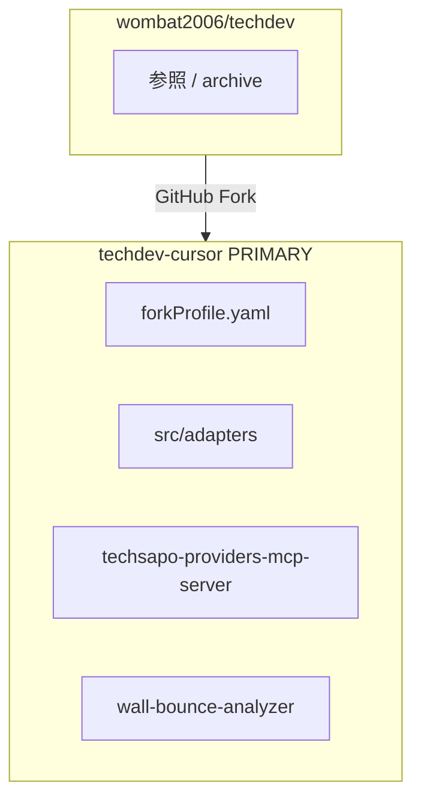

# Full-Fork: techdev-cursor（主開発リポジトリ）

*[English](../FORK_CURSOR.md) | **日本語***

**状態:** 採択済 — 実装ターゲットは upstream ではなく本フォーク  
**最終更新:** 2026-06-25（cross-repo handoff · README 実装分担）

---

## リポジトリ identity

**`techdev-cursor`** は **Cursor IDE 統合開発環境プロジェクト**。upstream **`techdev`**（Wall-Bounce マルチ LLM 基盤）のフォーク。

| 観点 | 定義 |
|------|------|
| **由来** | `wombat2006/techdev` の GitHub fork |
| **目的** | Cursor で **コーディング精度向上**と**負荷軽減**（WSL CLI、統一 stdio MCP、adapter、マルチ LLM レビュー） |
| **ではない** | **IT 障害解析** — InfraOps フォークラインの領域 |
| **またではない** | upstream 本番 ops の drop-in 置換 — Wall-Bounce API は dev/分析用に in-tree |
| **upstream の役割** | 参照 / cherry-pick 任意（`fork_primary`） |

**Upstream（参照）:** `wombat2006/techdev`  
**Primary（本フォーク）:** `techdev-cursor` — DevAssist ライン  
**Sibling platform:** `term-prep-platform` — glossary extract・コネクタ・MCP；consumer **outbound** [meta/platform-integration/](../../meta/platform-integration/README.md) · **inbound** `meta/consumer-handoff/` read-only — [README § 実装分担](../../README.md#実装分担techdev-cursor-vs-term-prep-platform) · [FORK_STATUS](./FORK_STATUS.md)

関連: [CURSOR_MCP_PLAN.md](../CURSOR_MCP_PLAN.md) · [CURSOR_MCP_TODO_ja.md](./CURSOR_MCP_TODO_ja.md) · [英語 runbook](../CURSOR_MCP_TODO.md)

---

## 決定事項（固定）

| # | 選択 |
|---|------|
| D1 | MCP topology | **統一** — 単一 `techsapo-providers` stdio |
| D2 | Repo model | **Full-Fork** — `techdev` ツリー全体 |
| D3 | Fork 名 | **`techdev-cursor`** — Cursor 統合 DevAssist |
| D4 | Upstream sync | **fork_primary** — フォークが primary |
| D5 | Merge-back | **任意** — cherry-pick のみ |

---

## リポジトリ layout（概念）

---

## フォーク setup（概要）

1. GitHub: `techdev` → `techdev-cursor` に Fork
2. WSL clone: `/home/<user>/techdev-cursor`
3. `git remote add upstream …`
4. タグ: `fork-base/…`
5. README: **PRIMARY — DevAssist** を明記
6. **[Fork bootstrap](../FORK_CURSOR.md#fork-bootstrap-mcp-implementation-ready)**（英語）— スタブ・ディレクトリ

---

## 統一 MCP（ターゲット architecture）

単一 stdio サーバー — `techsapo-codex` + `techsapo-claude` の二重登録 **ではない**。

| Tool | Provider | 備考 |
|------|----------|------|
| `analyze_claude` | Claude MAX/OAuth | `--print`, subscription |
| `analyze_codex` | Codex subscription | `codex exec` 非対話 |
| `analyze_agy` | Antigravity | `agy --print` |

**Cursor config** — `node dist/services/techsapo-providers-mcp-server.js`、`cwd` = フォーク root。

**新規モジュール:** `src/adapters/*`、`src/services/techsapo-providers-mcp-server.ts`

adapter は **CLI spawn のみ** — ネスト MCP 禁止。Wall-Bounce も同一 adapter（Track B）。

---

## Track（フォーク timeline）

| Track | スコープ | 優先度 |
|-------|----------|--------|
| **A-0** | WSL CLI + auth | MCP 登録前必須 |
| **A-1** | 統一 MCP + adapter | **高** — **完了** |
| **A-2** | MCP スキーマへ InferenceProfile | 高 |
| **A-3** | テンプレ + チーム登録 | 高 |
| **Gate A→B** | stdio · quota · Cursor から 3 tool | **Pass 2026-06-18** |
| **B** | `inference-profiles.json` · WB 配線 | **高 — 現在** |
| **C** | P5 Phase 0 | Runbook 参照 |
| **D** | tokenizer / cache | **低** |

### Track D（低優先）

Gate A→B クリティカルパス外。InferenceProfile preset と Ask vs Agent の方が ROI 高。

---

## Gate A→B（フォークローカル）

| # | 基準 |
|---|------|
| G1 | stdio transport のみ（TS-17） |
| G3 | Cursor Agent vs MCP tool の quota 理解 |
| G7 | Cursor から 3 `analyze_*` 成功 | **Pass 2026-06-18** |
| G-MEM | TS-22 v1.3 設計採択 | **2026-06-18**；M1 = Track B |
| G8 | `wall-bounce-analyzer` が adapter 使用 |
| G9 | `forkProfile.yaml` · bootstrap layout |

---

## fork_primary governance

| トピック | ルール |
|----------|--------|
| デフォルト clone | Cursor MCP 作業は `techdev-cursor` |
| upstream | 参照専用 |
| PR | フォーク `master` 向け |
| Cursor `cwd` | フォーク root |

---

## Fork bootstrap · スキーマ（詳細）

ディレクトリツリー、YAML/JSON サンプル、`package.json` scripts、Schema ↔ Track 表は **英語正本**に完全記載:

→ **[FORK_CURSOR.md — Fork bootstrap](../FORK_CURSOR.md#fork-bootstrap-mcp-implementation-ready)**  
→ **[FORK_CURSOR.md — Fork schemas](../FORK_CURSOR.md#fork-schemas)**  
→ **[MCP implementation sequence](../FORK_CURSOR.md#mcp-server-implementation-sequence-fork)**

実行チェックリスト: [CURSOR_MCP_TODO § A-0](../CURSOR_MCP_TODO.md#a-0-wsl-native-install--authentication)（英語）

---

## upstream に残るもの

- ADR、Runbook 構造、P5 提案
- Unified MCP **実装コード**はフォークで開発し、任意で upstream へ cherry-pick

---

## 関連

| 目的 | ドキュメント |
|------|-------------|
| **進捗** | [FORK_STATUS.md](./FORK_STATUS.md) |
| **設計深度** | [FORK_ONBOARDING.md](./FORK_ONBOARDING.md) |
| **実行要約** | [CURSOR_MCP_TODO_ja.md](./CURSOR_MCP_TODO_ja.md) |
